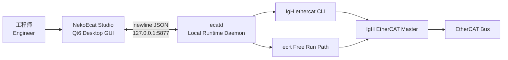
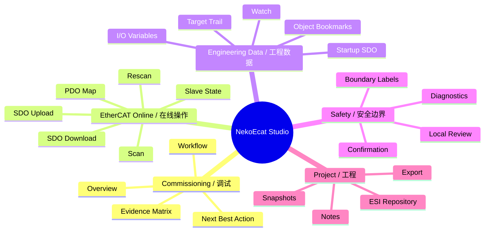
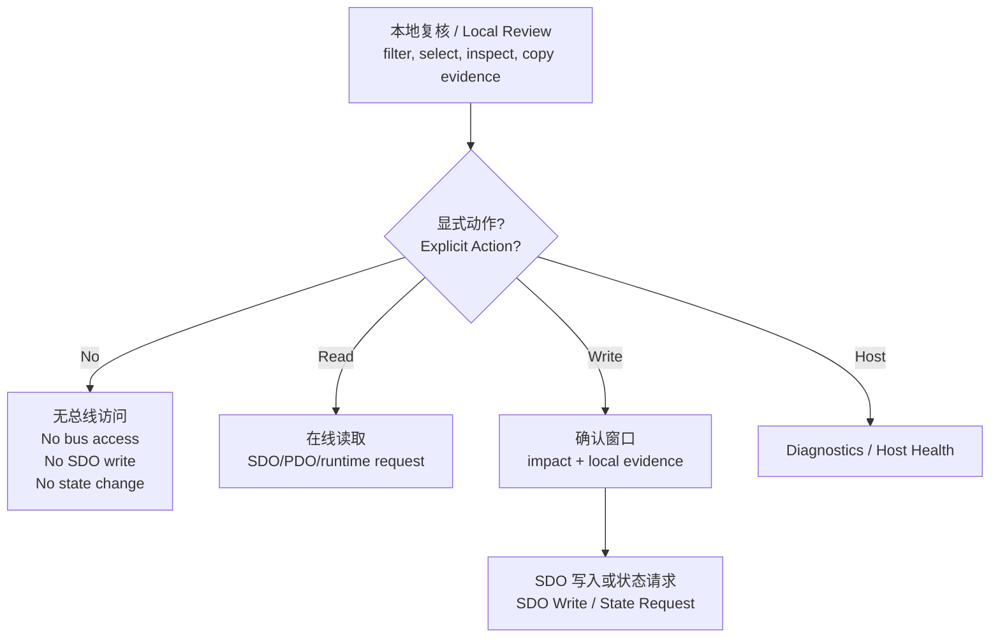

<p align="center">
  <h1 align="center">NekoEcat Studio</h1>
  <p align="center">
    <b>现代 EtherCAT 工程工作站 / Modern EtherCAT Engineering Workstation</b>
  </p>
  <p align="center">
    为 Linux + IgH EtherCAT Master 打造的高密度、证据驱动、面向现场调试的工程软件。<br>
    A dense, evidence-driven commissioning tool for Linux systems using IgH EtherCAT Master.
  </p>
</p>

<p align="center">
  
  
  
  
</p>

<p align="center">
  <b>Topology</b> · <b>Object Dictionary</b> · <b>PDO Map</b> · <b>SDO Evidence</b> ·
  <b>Startup SDO</b> · <b>Watch</b> · <b>Free Run</b> · <b>Diagnostics</b>
</p>

---

## 软件介绍 / Introduction

NekoEcat Studio 是一个面向真实 EtherCAT 调试现场的现代工程站。它不是简单包一层 `ethercat` 命令行，而是把拓扑扫描、从站证据、对象字典、SDO 读写、PDO 映射、Watch 监视、Startup SDO、Free Run 过程映像、I/O 变量工程表、状态机建议、诊断和工程文件管理组织成一套连续的工作流。

NekoEcat Studio is a modern EtherCAT workstation for real commissioning work. It is not just a thin wrapper around the `ethercat` CLI; it organizes topology, slave evidence, Object Dictionary workflows, SDO read/write operations, PDO maps, Watch values, Startup SDOs, Free Run telemetry, I/O variable engineering, state guidance, diagnostics, and project persistence into one coherent workflow.

它的目标是做成更像工程师每天愿意打开的工具：信息密度足够高，危险操作边界足够清楚，常用动作足够靠前，证据链足够完整。你可以把它理解成面向 Linux + IgH 生态的现代化 EtherCAT Studio，服务于调试、定位、复核、交接和逐步上线。

The product direction is straightforward: high information density, explicit safety boundaries, fast access to frequent operations, and a strong evidence trail. It aims to be a practical modern EtherCAT studio for the Linux + IgH ecosystem, useful for commissioning, triage, review, handoff, and controlled bring-up.

## 为什么它值得期待 / Why It Is Strong

- **工程视角优先 / Engineering-first UI**: Overview、Object Dictionary、Watch、Startup、Free Run、I/O Variables 都按任务组织，而不是把原始文本堆给用户。
- **证据驱动 / Evidence-driven**: OD、Watch、Startup、Bookmark、Target Trail、Free Run 和 I/O Variables 互相参与复核，写入前能看到本地证据是否一致。
- **危险边界清晰 / Clear safety boundaries**: 本地查看、复制、跳转不会偷偷读写总线；读 SDO、写 SDO、切状态、Free Run、Host Diagnostics 都是显式动作。
- **面向现场效率 / Built for field speed**: 高频 tab 靠前，命令面板、下一最佳动作、语义过滤、批量 Watch、批量 Startup 候选都减少重复点击。
- **可持续架构 / Sustainable architecture**: GUI、daemon、IgH 适配层、共享协议层分离，后续可以逐步替换 CLI 解析、扩展原生 runtime 能力。
- **比传统调试面板更完整 / More than a debug panel**: 它已经具备工程文件、项目备注、ESI 仓库、诊断报告、I/O 变量规划和状态机辅助。

## 系统架构 / Architecture



中文说明：

- `ecat-studio` 负责 GUI、工程工作流、表格、证据复核和交互。
- `ecatd` 是本地 runtime daemon，监听 `127.0.0.1:5877`。
- `src/igh` 负责 IgH EtherCAT Master 适配。
- `src/core` 保存共享类型和 JSON 协议。

English:

- `ecat-studio` owns the GUI, engineering workflows, tables, evidence review, and interaction.
- `ecatd` is the local runtime daemon listening on `127.0.0.1:5877`.
- `src/igh` isolates IgH EtherCAT Master integration.
- `src/core` contains shared types and JSON protocol helpers.

## 工作区一览 / Workspaces

| 工作区 / Workspace | 作用 / Purpose | 典型动作 / Typical Actions |
| --- | --- | --- |
| Overview / 总览 | 调试驾驶舱和从站上下文 | Session Brief、证据矩阵、调试工作流、下一最佳动作 |
| Object Dictionary / 对象字典 | SDO 工程工作台 | 过滤 OD、回填目标、读写 SDO、审阅本地证据 |
| PDO Map / PDO 映射 | 过程数据映射证据 | 查看 SM/PDO、定位对象、回填 SDO |
| Watch / 监视 | SDO 值和证据跟踪 | 刷新值、基线比较、Startup 偏差、CiA 402 信号 |
| Startup SDO / 启动项 | 可复用启动写入 | 预检查、校验、Watch 对比、确认后应用 |
| Free Run / 自由运行 | 周期过程映像遥测 | 启停 telemetry、查看输入输出过程值 |
| I/O Variables / I/O 变量 | 工程信号表 | 合并 PDO、Watch、Startup、Free Run、别名、标签、PLC 交接 |
| Consistency / 一致性 | 只读门禁 | 对比拓扑、Startup、Watch、I/O 变量和工程元数据 |
| Diagnostics / 诊断 | 运行时和主机证据 | 事件、Host Health、修复建议、诊断导出 |

## 产品能力地图 / Product Map



## 核心亮点 / Key Highlights

### 1. 对象字典不只是表格 / Object Dictionary Is More Than a Table

Object Dictionary 工作区支持语义过滤、自动回填 SDO 指令、Selected Object 目标工作台、证据摘要、Bookmark、Target Trail 和 SDO History。选择对象后，Index/Sub/Type 会自动进入指令区，便于直接读取、写入或生成 Watch/Startup 候选。

The Object Dictionary workspace supports semantic filters, automatic SDO field filling, a Selected Object workbench, evidence digest, bookmarks, target trail, and SDO history. Selecting an object fills Index/Sub/Type into the command area so the user can read, write, watch, or create Startup candidates quickly.

### 2. 写入前有证据 / Evidence Before Writes

SDO 写入前会汇总本地 Read、OD、Watch、Startup、Bookmark、Target Trail 证据，辅助判断待写值是否和已有证据一致。危险写入不会隐藏在按钮背后，而是走明确确认路径。

Before an SDO write, local Read, OD, Watch, Startup, Bookmark, and Target Trail evidence is summarized so the pending value can be compared with known data. Dangerous writes stay behind explicit confirmation.

### 3. Overview 是调试驾驶舱 / Overview as a Commissioning Cockpit

Overview 保留总线、从站、证据矩阵、Session Brief 和 Commissioning Workflow，不混入 Host Health。它更像一个现场调试驾驶舱，能告诉你当前缺什么证据、下一步应该做什么、风险在哪里。

Overview is kept focused on bus and selected-slave context: evidence matrix, session brief, workflow, and next best action. It behaves like a commissioning cockpit that shows missing evidence, next steps, and risk.

### 4. I/O Variables 连接工程和 PLC / I/O Variables Bridge Engineering and PLC Work

I/O Variables 把 PDO Map、Free Run、Watch、Startup 期望、别名、标签、备注和 PLC 交接质量放在同一张工程表里，适合从现场数据走向工程命名和后续 PLC 对接。

I/O Variables merges PDO Map, Free Run, Watch, Startup expectations, aliases, tags, notes, and PLC handoff quality into one engineering table, helping move from raw bus data to structured signal planning.

### 5. 可持续拆分 / Built to Grow

项目不是所有逻辑都塞进一个二进制黑盒。GUI、daemon、IgH backend、core protocol、测试模型逐步拆分，后续可以继续增强 runtime、协议和多从站工程能力。

The project is not a single opaque binary. GUI, daemon, IgH backend, core protocol, and tested models are separated so runtime capabilities, protocol behavior, and multi-slave engineering features can keep growing.

## 安全模型 / Safety Model



本地动作包括选择行、过滤表格、打开证据链接、复制摘要、查看详情条。这些操作不会自动读总线、写 SDO、切状态或启动 Free Run。在线动作必须显式触发。

Local actions include row selection, filtering, opening evidence links, copying digests, and reading detail panels. These do not automatically read the bus, write SDOs, change state, or start Free Run. Online actions must be explicitly triggered.

## 仓库结构 / Repository Layout

```text
.
├── apps/
│   ├── ecat-studio/      Qt desktop GUI and UI/domain helper models
│   └── ecatd/            local runtime daemon
├── src/
│   ├── core/             shared EtherCAT types and JSON protocol helpers
│   └── igh/              IgH EtherCAT Master integration layer
├── tests/                focused model, adapter, and smoke tests
├── CMakeLists.txt
└── README.md
```

`docs/` 当前加入 `.gitignore`，公开首页文档集中维护在 README。  
`docs/` is currently ignored by `.gitignore`; public-facing documentation is maintained in this README.

## 环境需求 / Requirements

构建需求 / Build-time:

- CMake 3.20+
- C++20 compiler
- Qt6 Core, Network, Widgets development packages

真实硬件运行需求 / Runtime for real hardware:

- Linux
- IgH EtherCAT Master installed and configured
- `ethercat` CLI available in the runtime environment
- Proper permissions for the IgH master device

没有硬件时也可以启动 GUI 做 UI 检查、工程文件编辑和 offscreen smoke test。真实在线访问仍依赖主机 EtherCAT 环境。

The GUI can launch without hardware for UI review, project-file work, and offscreen smoke tests. Real online access still depends on the host EtherCAT environment.

## 构建 / Build

```bash
cmake -S . -B build
cmake --build build
```

只构建 GUI / Build GUI only:

```bash
cmake --build build --target ecat-studio
```

只构建 daemon / Build daemon only:

```bash
cmake --build build --target ecatd
```

## 运行 / Run

手动调试 daemon / Start daemon manually:

```bash
./build/apps/ecatd/ecatd
```

启动 GUI / Launch GUI:

```bash
./build/apps/ecat-studio/ecat-studio
```

GUI 通常会自动启动或连接 `ecatd`。daemon 默认监听 `127.0.0.1:5877`。  
The GUI normally attempts to launch or connect to `ecatd`. The daemon listens on `127.0.0.1:5877`.

## 验证 / Verification

快速发布 smoke / Fast release smoke:

```bash
cmake --build build --target ecat-studio
cmake --build build --target ecatd
cmake --build build --target release-smoke
QT_QPA_PLATFORM=offscreen timeout 5s build/apps/ecat-studio/ecat-studio
```

offscreen GUI smoke 预期返回 `124`，因为 `timeout` 会在启动后停止 GUI。  
The offscreen GUI smoke is expected to return `124` because `timeout` stops the app after startup.

大范围模型、CMake、协议或工作流变更建议运行 / For broader model, CMake, protocol, or workflow changes:

```bash
ctest --test-dir build --output-on-failure
```

## 发布包 / Release Package

最小 Linux 发布包 / Minimal Linux package:

```text
bin/ecat-studio
bin/ecatd
README.md
```

打包示例 / Example:

```bash
mkdir -p dist/NekoEcat-Studio-v0.1.0-linux-x86_64/bin
cp build/apps/ecat-studio/ecat-studio dist/NekoEcat-Studio-v0.1.0-linux-x86_64/bin/
cp build/apps/ecatd/ecatd dist/NekoEcat-Studio-v0.1.0-linux-x86_64/bin/
cp README.md dist/NekoEcat-Studio-v0.1.0-linux-x86_64/
tar -C dist -czf dist/NekoEcat-Studio-v0.1.0-linux-x86_64.tar.gz NekoEcat-Studio-v0.1.0-linux-x86_64
```

## 工程文件 / Project Files

工程文件是 JSON 格式 `.ecatproj`。新文件使用 `NekoEcatStudioProject` 标记，旧 `EtherCATStudioProject` 文件仍可读取以保持兼容。

Project files are JSON-based `.ecatproj` files. New files use the `NekoEcatStudioProject` marker, while older `EtherCATStudioProject` files remain readable for compatibility.

工程可保存 / Project data can include:

- master profiles / 主站配置
- selected SDO target / 当前 SDO 目标
- SDO evidence / SDO 证据
- topology baseline / 拓扑基线
- Watch rows / Watch 行
- Startup SDO rows / Startup SDO 行
- target trail / 目标轨迹
- object bookmarks / 对象书签
- I/O variable metadata / I/O 变量元数据
- project notes / 工程备注
- raw evidence snapshots / 原始证据快照

## 开发原则 / Development Principles

- 本地复核路径必须保持本地，不应偷偷触发在线操作。  
  Keep GUI-only review/navigation local-only unless the user explicitly triggers an online action.
- 共享行为应逐步沉淀到 helper model 或 adapter。  
  Move shared behavior into helper models or adapters when it grows beyond a narrow UI concern.
- UI-only 改动优先跑 focused smoke。  
  Prefer focused smoke tests for UI-only changes.
- 模型、协议、CMake 或工作流风险变更应跑更完整测试。  
  Use broader tests for shared model, CMake, protocol, or workflow changes.
- 不提交构建产物。  
  Do not commit generated build output.

## 当前状态 / Status

NekoEcat Studio 当前定位为活跃开发中的工程工具，适合开发、实验室验证和主机 EtherCAT 环境已配置好的受控调试流程。它已经具备工程站雏形：不是玩具 UI，不是命令行皮肤，而是向真正现场软件演进的 EtherCAT 工程平台。

NekoEcat Studio is an active engineering tool suitable for development, lab validation, and controlled commissioning workflows where the host EtherCAT environment is already configured. It is already shaped as a real workstation: not a toy UI, not a command-line skin, but an EtherCAT engineering platform moving toward practical field use.

## 许可证 / License

本项目使用 GNU General Public License v3.0。详见 [`LICENSE`](LICENSE)。  
This project is licensed under the GNU General Public License v3.0. See [`LICENSE`](LICENSE).
