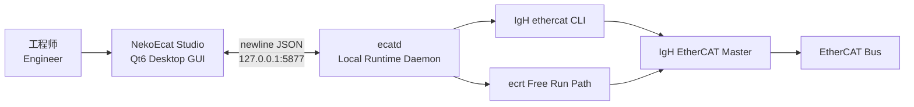
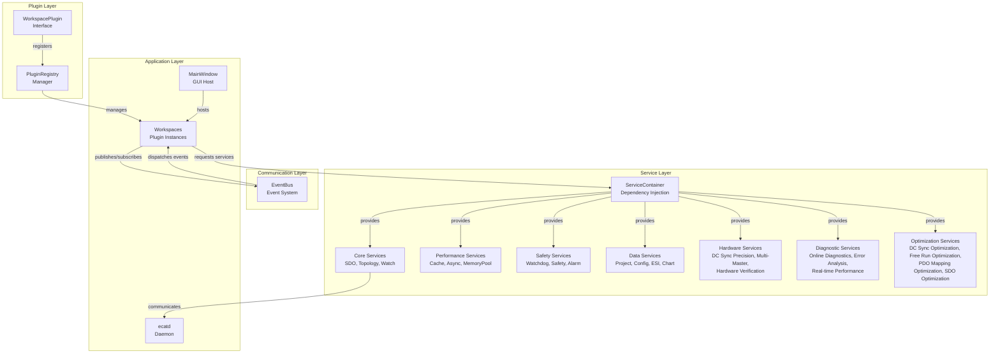
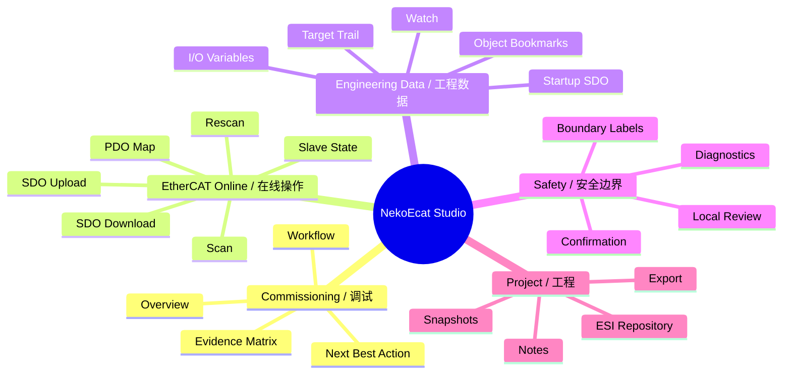
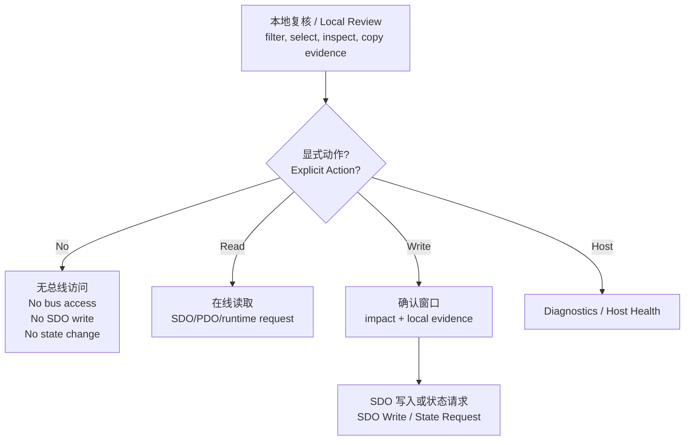

<p align="center">
  <h1 align="center">NekoEcat Studio</h1>
  <p align="center">
    <b>现代 EtherCAT 工程工作站 / Modern EtherCAT Engineering Workstation</b>
  </p>
  <p align="center">
    为 Linux + IgH EtherCAT Master 打造的高密度、证据驱动、面向现场调试的工程软件。<br>
    A dense, evidence-driven commissioning tool for Linux systems using IgH EtherCAT Master.
  </p>
</p>

<p align="center">
  
  
  
  
</p>

<p align="center">
  <b>Topology</b> · <b>Object Dictionary</b> · <b>PDO Map</b> · <b>SDO Evidence</b> ·
  <b>Startup SDO</b> · <b>Watch</b> · <b>Free Run</b> · <b>Diagnostics</b><br>
  <b>DC Sync</b> · <b>AL Events</b> · <b>Signal Analyzer</b> · <b>Adapter Selection</b> · <b>Plugin Architecture</b><br>
  <b>PDO Mapping Editor</b> · <b>ESI Browser</b> · <b>Online Diagnostics</b> · <b>DC Sync Precision</b> ·
  <b>Multi-Master</b> · <b>Real-time Performance</b> · <b>Error Analysis</b> · <b>Hardware Verification</b><br>
  <b>DC Sync Optimization</b> · <b>Free Run Optimization</b> · <b>PDO Mapping Optimization</b> · <b>SDO Optimization</b>
</p>

---

## 软件介绍 / Introduction

NekoEcat Studio 是一个面向 Linux + IgH 生态的 EtherCAT 工程工作站。它不是简单包一层 `ethercat` 命令行，而是把拓扑扫描、从站证据、对象字典、SDO 读写、PDO 映射、Watch 监视、Startup SDO、Free Run 过程映像、I/O 变量工程表、状态机建议、诊断和工程文件管理组织成一套连续的受控调试工作流。

NekoEcat Studio is an EtherCAT engineering workstation for the Linux + IgH ecosystem. It is not just a thin wrapper around the `ethercat` CLI; it organizes topology, slave evidence, Object Dictionary workflows, SDO read/write operations, PDO maps, Watch values, Startup SDOs, Free Run telemetry, I/O variable engineering, state guidance, diagnostics, and project persistence into one controlled debugging workflow.

它的目标是做成更像工程师每天愿意打开的工具：信息密度足够高，危险操作边界足够清楚，常用动作足够靠前，证据链足够明确。你可以把它理解成面向 Linux + IgH 生态的现代化 EtherCAT Studio，服务于调试、定位、复核、交接和发布前验证。

The product direction is straightforward: high information density, explicit safety boundaries, fast access to frequent operations, and a strong evidence trail. It aims to be a practical modern EtherCAT studio for the Linux + IgH ecosystem, useful for debugging, triage, review, handoff, and release-time validation.

## 为什么它值得期待 / Why It Is Strong

- **工程视角优先 / Engineering-first UI**: Overview、Object Dictionary、Watch、Startup、Free Run、I/O Variables 都按任务组织，而不是把原始文本堆给用户。
- **证据驱动 / Evidence-driven**: OD、Watch、Startup、Bookmark、Target Trail、Free Run 和 I/O Variables 互相参与复核，写入前能看到本地证据是否一致。
- **危险边界清晰 / Clear safety boundaries**: 本地查看、复制、跳转不会偷偷读写总线；读 SDO、写 SDO、切状态、Free Run、Host Diagnostics 都是显式动作。
- **面向调试效率 / Built for debugging speed**: 高频 tab 靠前，命令面板、下一最佳动作、语义过滤、批量 Watch、批量 Startup 候选都减少重复点击。
- **可持续架构 / Sustainable architecture**: GUI、daemon、IgH 适配层、共享协议层分离，后续可以逐步替换 CLI 解析、扩展原生 runtime 能力。
- **插件系统 / Plugin Architecture**: WorkspacePlugin 接口 + EventBus 事件总线 + Service 服务层，每个工作区独立为插件，便于扩展和维护。
- **硬件诊断 / Hardware Diagnostics**: DC Sync 分布式时钟监控、AL Event 应用层事件跟踪、网络适配器管理，用于补齐 Linux + IgH 调试证据。
- **实时信号分析 / Real-time Signal Analysis**: 多通道信号采集、QPainter 反锯齿滚动图表、10,000 点环形缓冲、统计分析。
- **工程上下文 / Engineering context**: 它已经具备工程文件、项目备注、ESI 仓库、诊断报告、I/O 变量规划和状态机辅助。

## 系统架构 / Architecture



中文说明：

- `ecat-studio` 负责 GUI、工程工作流、表格、证据复核和交互。
- `ecatd` 是本地 runtime daemon，监听 `127.0.0.1:5877`。
- `src/igh` 负责 IgH EtherCAT Master 适配。
- `src/core` 保存共享类型和 JSON 协议。

English:

- `ecat-studio` owns the GUI, engineering workflows, tables, evidence review, and interaction.
- `ecatd` is the local runtime daemon listening on `127.0.0.1:5877`.
- `src/igh` isolates IgH EtherCAT Master integration.
- `src/core` contains shared types and JSON protocol helpers.

### 原生 IgH API 支持 (v3.8.0+)

NekoEcat Studio 现在支持原生 IgH ecrt API 进行高性能 EtherCAT 操作：

- **SDO 操作**: 支持 `ecrt_master_sdo_upload/download`，未覆盖路径继续回退 CLI
- **拓扑扫描**: 使用 `ecrt_master_get_slave` 直接获取从站信息
- **PDO 信息**: 使用 `ecrt_master_get_sync_manager/pdo` 获取 PDO 结构
- **自动回退**: 如果原生 API 不可用，自动回退到 CLI 后端

性能说明：原生后端避免为已覆盖路径启动 `ethercat` 进程；实际延迟取决于 IgH 版本、主站状态、从站响应和后端模式。现场性能以本机基准为准。

### 双后端模式

在设置中可以选择后端模式：
- **自动 (推荐)**: 自动选择最佳可用后端
- **IgH 原生 API**: 强制使用原生 API（需要 IgH 支持）
- **IgH 命令行**: 强制使用 CLI 后端（兼容性最好）

### 插件系统架构 / Plugin System Architecture



插件系统采用分层架构设计：

- **WorkspacePlugin 接口**：定义工作区插件的生命周期和行为契约
- **PluginRegistry**：管理插件注册、发现和实例化
- **EventBus**：松耦合的事件发布/订阅系统，连接插件间通信
- **ServiceContainer**：依赖注入容器，提供 ESI、拓扑等共享服务

The plugin system uses a layered architecture:

- **WorkspacePlugin interface**: Defines lifecycle and behavior contracts for workspace plugins
- **PluginRegistry**: Manages plugin registration, discovery, and instantiation
- **EventBus**: Loose-coupled publish/subscribe event system for inter-plugin communication
- **ServiceContainer**: Dependency injection container providing shared services (ESI, topology, etc.)

## 工作区一览 / Workspaces

> Experimental note: AI, Blockchain, Quantum Security, Cloud, Edge, and Digital Twin surfaces are experimental/stub-backed unless the project is built with `-DECAT_EXPERIMENTAL_SERVICES=ON`. They are not part of the stable EtherCAT commissioning path.

| 工作区 / Workspace | 作用 / Purpose | 典型动作 / Typical Actions |
| --- | --- | --- |
| Overview / 总览 | 调试驾驶舱和从站上下文 | Session Brief、证据矩阵、调试工作流、下一最佳动作 |
| Object Dictionary / 对象字典 | SDO 工程工作台 | 过滤 OD、回填目标、读写 SDO、审阅本地证据 |
| PDO Map / PDO 映射 | 过程数据映射证据 | 查看 SM/PDO、定位对象、回填 SDO |
| Watch / 监视 | SDO 值和证据跟踪 | 刷新值、基线比较、Startup 偏差、CiA 402 信号 |
| Startup SDO / 启动项 | 可复用启动写入 | 预检查、校验、Watch 对比、确认后应用 |
| Free Run / 自由运行 | 周期过程映像遥测 | 启停 telemetry、查看输入输出过程值 |
| I/O Variables / I/O 变量 | 工程信号表 | 合并 PDO、Watch、Startup、Free Run、别名、标签、PLC 交接 |
| Consistency / 一致性 | 只读门禁 | 对比拓扑、Startup、Watch、I/O 变量和工程元数据 |
| Diagnostics / 诊断 | 运行时和主机证据 | 事件、Host Health、修复建议、诊断导出 |
| DC Sync / DC 同步 | 分布式时钟同步诊断 | 参考时钟、漂移、抖动统计、每从站同步状态 |
| AL Events / AL 事件 | 应用层事件日志 | 时间戳、错误码、严重级别过滤、自动滚动 |
| Signal Analyzer / 信号分析 | 实时多通道波形 | 添加通道、滚动图表、统计信息、窗口大小调节 |
| Network Adapter / 网络适配器 | IgH 网卡选择 | 检测可用网卡、选择适配器、查看驱动和链路状态 |
| Topology Graph / 图形拓扑 | 图形化总线拓扑节点视图 | 线性/树形布局、缩放、平移、节点交互 |
| ESI Repository / ESI 仓库 | ESI XML 文件管理和浏览 | 导入 ESI、浏览设备描述、管理 ESI 库 |
| Bus Statistics / 总线统计 | 实时总线性能指标和统计 | 带宽利用率、帧计数、错误率、延迟统计 |
| Performance Monitor / 性能监控 | 系统性能监控仪表板 | CPU/内存使用、循环周期、抖动监控 |
| RT Test / 实时测试 | 实时周期时序稳定性测试 | 周期抖动测量、时序偏差分析、稳定性评估 |
| Dashboard / 仪表盘 | 可配置仪表盘和计数器 | 仪表盘布局、计数器、火花图、自动刷新 |
| Chart / 图表 | 数据可视化 | 折线/柱状/饼图/散点/仪表图、数据源选择、导出 |
| Oscilloscope / 示波器 | 实时多通道波形显示 | 时间基准、触发模式、光标测量、FFT 分析 |
| Protocol Analyzer / 协议分析 | EtherCAT 协议帧分析 | 帧捕获、协议解码、过滤、统计、PCAP 导出 |
| Automation / 自动化 | JavaScript 脚本编辑和执行 | 脚本编辑器、控制台输出、模板插入、运行/停止 |
| Alarm / 告警 | 系统告警管理 | 严重级别过滤、确认/清除操作、告警历史导出 |
| Project / 工程 | 工程管理和配置 | 工程树导航、配置页面、导入/导出 |
| Data Pipeline / 数据管道 | 数据管道管理 | 管道配置、阶段管理、监控 |
| Device Manager / 设备管理 | 设备发现和管理 | 设备扫描、配置、状态监控 |
| Master Manager / 主站管理 | EtherCAT 主站管理 | 主站信息、诊断、重启、日志查看 |
| Digital Twin Studio / 数字孪生 | Experimental / 实验：数字孪生建模和管理 | Opt-in build only; not part of the stable commissioning path |
| Blockchain Explorer / 区块链浏览器 | Experimental / 实验：区块链审计和浏览 | Opt-in build only; not part of the stable commissioning path |
| Quantum Security / 量子安全 | Experimental / 实验：量子加密和安全管理 | Opt-in build only; not part of the stable commissioning path |
| PDO Mapping Editor / PDO 映射编辑器 | 可视化 PDO 映射配置 | 画布拖拽、映射验证、SM/PDO 分配、导出 |
| ESI Browser / ESI 浏览器 | ESI 设备描述浏览和管理 | 树形浏览、设备匹配、PDO 查找、多文件导入 |
| Online Diagnostics / 在线诊断 | 实时总线监控和错误分析 | 总线监控、错误分析器、健康评分、修复建议 |
| DC Sync Precision / DC 同步精度 | DC 同步精度深度分析 | 漂移监控、抖动分析、同步精度评估 |
| Multi-Master / 多主站 | 多 EtherCAT 主站管理 | 主站对比、跨主站管理、并排诊断 |
| Real-time Performance / 实时性能 | 实时性能指标监控 | 延迟监控、吞吐量监控、环形缓冲统计 |
| Error Analysis / 错误分析 | 高级错误分析和根因定位 | 错误时间线、错误关联、跨从站模式识别 |
| Hardware Verification / 硬件验证 | 上线前硬件完整性检查 | 设备验证、网络验证、完整性报告 |
| DC Sync Optimization / DC 同步优化 | DC 分布式时钟同步优化 | 同步优化、漂移优化、抖动优化、配置优化 |
| Free Run Optimization / 自由运行优化 | Free Run 过程数据交换优化 | 周期时间优化、数据映射优化、性能优化 |
| PDO Mapping Optimization / PDO 映射优化 | PDO 映射配置优化 | 映射优化、大小优化、对齐优化、性能优化 |
| SDO Optimization / SDO 优化 | SDO 通信优化 | 缓存优化、批处理优化、性能优化、错误处理优化 |

## 产品能力地图 / Product Map



## 核心亮点 / Key Highlights

### 1. 对象字典不只是表格 / Object Dictionary Is More Than a Table

Object Dictionary 工作区支持语义过滤、自动回填 SDO 指令、Selected Object 目标工作台、证据摘要、Bookmark、Target Trail 和 SDO History。选择对象后，Index/Sub/Type 会自动进入指令区，便于直接读取、写入或生成 Watch/Startup 候选。

The Object Dictionary workspace supports semantic filters, automatic SDO field filling, a Selected Object workbench, evidence digest, bookmarks, target trail, and SDO history. Selecting an object fills Index/Sub/Type into the command area so the user can read, write, watch, or create Startup candidates quickly.

### 2. 写入前有证据 / Evidence Before Writes

SDO 写入前会汇总本地 Read、OD、Watch、Startup、Bookmark、Target Trail 证据，辅助判断待写值是否和已有证据一致。危险写入不会隐藏在按钮背后，而是走明确确认路径。

Before an SDO write, local Read, OD, Watch, Startup, Bookmark, and Target Trail evidence is summarized so the pending value can be compared with known data. Dangerous writes stay behind explicit confirmation.

### 3. Overview 是调试驾驶舱 / Overview as a Commissioning Cockpit

Overview 保留总线、从站、证据矩阵、Session Brief 和 Commissioning Workflow，不混入 Host Health。它更像一个现场调试驾驶舱，能告诉你当前缺什么证据、下一步应该做什么、风险在哪里。

Overview is kept focused on bus and selected-slave context: evidence matrix, session brief, workflow, and next best action. It behaves like a commissioning cockpit that shows missing evidence, next steps, and risk.

### 4. I/O Variables 连接工程和 PLC / I/O Variables Bridge Engineering and PLC Work

I/O Variables 把 PDO Map、Free Run、Watch、Startup 期望、别名、标签、备注和 PLC 交接质量放在同一张工程表里，适合从现场数据走向工程命名和后续 PLC 对接。

I/O Variables merges PDO Map, Free Run, Watch, Startup expectations, aliases, tags, notes, and PLC handoff quality into one engineering table, helping move from raw bus data to structured signal planning.

### 5. 可持续拆分 / Built to Grow

项目不是所有逻辑都塞进一个二进制黑盒。GUI、daemon、IgH backend、core protocol、测试模型逐步拆分，后续可以继续增强 runtime、协议和多从站工程能力。

The project is not a single opaque binary. GUI, daemon, IgH backend, core protocol, and tested models are separated so runtime capabilities, protocol behavior, and multi-slave engineering features can keep growing.

### 6. PDO Mapping Editor / PDO 映射编辑器

PDO Mapping Editor 提供可视化的 PDO 映射配置界面，包含画布式映射拖拽、映射验证器和实时预览。支持 SM/PDO 分配、条目管理和导出功能。

The PDO Mapping Editor provides a visual PDO mapping configuration interface with canvas-based drag-and-drop mapping, a mapping validator, and real-time preview. Supports SM/PDO assignment, entry management, and export.

### 7. ESI Browser / ESI 浏览器

ESI Browser 增强了 ESI 仓库功能，提供树形设备浏览、PDO 映射查找和设备匹配。支持导入多个 ESI XML 文件并按厂商/产品号检索。

The ESI Browser enhances the ESI repository with tree-based device browsing, PDO mapping lookup, and device matching. Supports importing multiple ESI XML files and searching by vendor/product ID.

### 8. Online Diagnostics / 在线诊断

Online Diagnostics 提供实时总线监控、错误分析器和健康评分。包含 BusMonitorWidget 和 ErrorAnalyzerWidget，支持帧计数、错误率跟踪和自动修复建议。

Online Diagnostics provides real-time bus monitoring, error analysis, and health scoring. Includes BusMonitorWidget and ErrorAnalyzerWidget with frame counting, error rate tracking, and automated fix suggestions.

### 9. DC Sync Precision / DC 同步精度

DC Sync Precision 扩展了基础 DC Sync 诊断，提供漂移监控、抖动分析和每从站同步精度评估。包含 DriftMonitorWidget 和 JitterAnalysisWidget。

DC Sync Precision extends basic DC Sync diagnostics with drift monitoring, jitter analysis, and per-slave synchronization precision assessment. Includes DriftMonitorWidget and JitterAnalysisWidget.

### 10. Multi-Master Support / 多主站支持

Multi-Master 支持同时管理多个 EtherCAT 主站，提供主站对比视图和跨主站从站管理。包含 MasterComparisonWidget 用于并排诊断。

Multi-Master supports managing multiple EtherCAT masters simultaneously with a master comparison view and cross-master slave management. Includes MasterComparisonWidget for side-by-side diagnostics.

### 11. Real-time Performance Monitor / 实时性能监控

Real-time Performance Monitor 提供延迟监控、吞吐量监控和实时性能指标可视化。包含 LatencyMonitorWidget 和 ThroughputMonitorWidget，支持 1000 点环形缓冲。

Real-time Performance Monitor provides latency monitoring, throughput monitoring, and real-time performance metric visualization. Includes LatencyMonitorWidget and ThroughputMonitorWidget with 1000-sample ring buffers.

### 12. Advanced Error Analysis / 高级错误分析

Advanced Error Analysis 提供错误时间线、错误关联分析和根因定位。包含 ErrorTimelineWidget 和 ErrorCorrelationWidget，支持跨从站错误模式识别。

Advanced Error Analysis provides error timeline, error correlation analysis, and root cause identification. Includes ErrorTimelineWidget and ErrorCorrelationWidget with cross-slave error pattern recognition.

### 13. Hardware Verification / 硬件验证

Hardware Verification 提供设备验证和网络验证工具，用于上线前的硬件完整性检查。包含 DeviceVerificationWidget 和 NetworkVerificationWidget。

Hardware Verification provides device verification and network verification tools for pre-commissioning hardware integrity checks. Includes DeviceVerificationWidget and NetworkVerificationWidget.

### 14. DC Sync Optimization / DC 同步优化

DC Sync Optimization 提供 DC 分布式时钟同步优化，包含同步优化、漂移优化、抖动优化和配置优化四个子功能。通过 SyncOptimizationWidget 和 DriftOptimizationWidget 实现可视化优化界面。

DC Sync Optimization provides DC distributed clock synchronization optimization with sync optimization, drift optimization, jitter optimization, and configuration optimization. Implements visual optimization via SyncOptimizationWidget and DriftOptimizationWidget.

### 15. Free Run Optimization / 自由运行优化

Free Run Optimization 提供 Free Run 过程数据交换优化，包含周期时间优化、数据映射优化、性能优化和错误处理优化。通过 CycleTimeOptimizerWidget 和 DataMappingOptimizerWidget 实现优化控制。

Free Run Optimization provides Free Run process data exchange optimization with cycle time optimization, data mapping optimization, performance optimization, and error handling optimization. Implements optimization control via CycleTimeOptimizerWidget and DataMappingOptimizerWidget.

### 16. PDO Mapping Optimization / PDO 映射优化

PDO Mapping Optimization 提供 PDO 映射配置优化，包含映射优化、大小优化、对齐优化和性能优化。通过 MappingOptimizerWidget 和 SizeOptimizerWidget 实现映射优化分析。

PDO Mapping Optimization provides PDO mapping configuration optimization with mapping optimization, size optimization, alignment optimization, and performance optimization. Implements mapping optimization analysis via MappingOptimizerWidget and SizeOptimizerWidget.

### 17. SDO Optimization / SDO 优化

SDO Optimization 提供 SDO 通信优化，包含缓存优化、批处理优化、性能优化和错误处理优化。通过 CacheOptimizerWidget 和 BatchOptimizerWidget 实现优化管理。

SDO Optimization provides SDO communication optimization with cache optimization, batch optimization, performance optimization, and error handling optimization. Implements optimization management via CacheOptimizerWidget and BatchOptimizerWidget.

### 18. 性能与可靠性 / Performance & Reliability

- **LRU 缓存 / LRU Cache**: SDO、拓扑、PDO、ESI 数据的通用缓存，支持 TTL 过期和每类型配置。
- **异步操作 / Async Operations**: 优先级队列管理，支持超时、取消和进度跟踪。
- **看门狗监控 / Watchdog Monitoring**: 每从站看门狗状态跟踪，超时计数和触发记录。
- **安全控制器 / Safety Controller**: 状态转换、SDO 写入和 Free Run 的安全边界验证。
- **内存池 / Memory Pool**: 固定大小对象池，减少频繁分配的开销，支持溢出回退。
- **诊断报告 / Diagnostic Reports**: 拓扑、从站、性能、DC 同步、看门狗的综合报告生成。
- **连接池 / Connection Pool**: TCP 连接池，支持连接复用、健康检查和自动重连。
- **启动优化 / Startup Optimization**: 懒加载初始化、并行初始化和预加载常用数据。
- **数据缓存 / Data Cache**: 专用 SDO/PDO 数据缓存，支持批量操作、预取和统计。
- **批处理 / Batch Processing**: 批量 SDO/状态操作，支持进度跟踪和取消。

## 插件架构 / Plugin Architecture

NekoEcat Studio 采用插件化架构，每个工作区都是独立的插件实现。核心组件包括：

NekoEcat Studio uses a plugin-based architecture where each workspace is an independent plugin implementation. Core components include:

- **WorkspacePlugin**：工作区插件接口，定义 `initialize()`、`shutdown()`、`workspaceId()` 等生命周期方法
- **PluginRegistry**：插件注册中心，负责插件发现、实例化和生命周期管理。使用 QVector + QMap 双重存储，支持 O(1) 索引访问和 O(log n) id 查找。注册时自动按 defaultOrder() 排序，确保一致的标签页顺序。
- **EventBus**：全局事件总线，支持松耦合的发布/订阅通信模式。提供 8 种事件类型，通过 Qt 信号槽机制实现类型安全的事件分发。
- **ServiceContainer**：服务容器，提供依赖注入和服务定位，具体服务集合以当前注册代码为准。使用单一 EcatClient 实例和 Qt 父子对象树管理服务生命周期，支持自动清理。

- **WorkspacePlugin**: Workspace plugin interface defining lifecycle methods like `initialize()`, `shutdown()`, `workspaceId()`
- **PluginRegistry**: Plugin registry handling discovery, instantiation, and lifecycle management. Uses QVector + QMap dual storage for O(1) index access and O(log n) id lookup. Automatically sorts by defaultOrder() on registration for consistent tab ordering.
- **EventBus**: Global event bus supporting loose-coupled publish/subscribe communication. Provides 8 event types with type-safe dispatch via Qt signals/slots.
- **ServiceContainer**: Service container providing dependency injection and service location; the concrete service set is defined by the current registration code. Uses Qt parent-child object tree for automatic service lifetime management and cleanup.

详细插件开发指南请参阅 [`PLUGIN_GUIDE.md`](PLUGIN_GUIDE.md)。

For detailed plugin development guide, see [`PLUGIN_GUIDE.md`](PLUGIN_GUIDE.md).

## 安全模型 / Safety Model



本地动作包括选择行、过滤表格、打开证据链接、复制摘要、查看详情条。这些操作不会自动读总线、写 SDO、切状态或启动 Free Run。在线动作必须显式触发。

Local actions include row selection, filtering, opening evidence links, copying digests, and reading detail panels. These do not automatically read the bus, write SDOs, change state, or start Free Run. Online actions must be explicitly triggered.

## 仓库结构 / Repository Layout

```text
.
├── apps/
│   ├── ecat-studio/          Qt6 desktop GUI
│   │   ├── models/           pure data/logic types (no widget deps)
│   │   ├── adapters/         model <-> QTableWidget bridge
│   │   ├── ui_state/         detail panel text builders
│   │   ├── helpers/          reusable utilities (table, text, UI)
│   │   ├── infra/            TCP client, shared types, settings
│   │   ├── workspaces/       MainWindow partials per workspace
│   │   ├── plugins/          workspace plugin implementations
│   │   ├── services/         service layer (ESI, topology, etc.)
│   │   ├── handlers/         event handlers and command processors
│   │   ├── themes/           UI theme definitions and styles
│   │   ├── translations/     i18n translation files
│   │   ├── MainWindow.h/cpp  core window + entry point
│   │   └── main.cpp
│   └── ecatd/                local runtime daemon
├── src/
│   ├── core/                 shared EtherCAT types and JSON protocol
│   └── igh/                  IgH EtherCAT Master adapter
├── tests/                    model, adapter, and UI state tests
├── scripts/                  packaging scripts
├── tools/                    development and utility tools
├── CMakeLists.txt
└── README.md
```

`docs/` 当前加入 `.gitignore`，公开首页文档集中维护在 README。  
`docs/` is currently ignored by `.gitignore`; public-facing documentation is maintained in this README.

## 环境需求 / Requirements

构建需求 / Build-time:

- CMake 3.20+
- C++20 compiler
- Qt6 Core, Network, Widgets development packages

真实硬件运行需求 / Runtime for real hardware:

- Linux
- IgH EtherCAT Master installed and configured
- `ethercat` CLI available in the runtime environment
- Proper permissions for the IgH master device

没有硬件时也可以启动 GUI 做 UI 检查、工程文件编辑和 offscreen smoke test。真实在线访问仍依赖主机 EtherCAT 环境。

The GUI can launch without hardware for UI review, project-file work, and offscreen smoke tests. Real online access still depends on the host EtherCAT environment.

## 构建 / Build

```bash
cmake -S . -B build
cmake --build build -j$(nproc)
```

只构建 GUI / Build GUI only:

```bash
cmake --build build --target ecat-studio -j$(nproc)
```

只构建 daemon / Build daemon only:

```bash
cmake --build build --target ecatd -j$(nproc)
```

运行测试 / Run tests:

```bash
ctest --test-dir build --output-on-failure
```

发布 smoke 测试 / Release smoke test:

```bash
cmake --build build --target release-smoke
```

## 运行 / Run

手动调试 daemon / Start daemon manually:

```bash
./build/apps/ecatd/ecatd
```

启动 GUI / Launch GUI:

```bash
./build/apps/ecat-studio/ecat-studio
```

GUI 通常会自动启动或连接 `ecatd`。daemon 默认监听 `127.0.0.1:5877`。  
The GUI normally attempts to launch or connect to `ecatd`. The daemon listens on `127.0.0.1:5877`.

## 验证 / Verification

快速发布 smoke / Fast release smoke:

```bash
cmake --build build --target ecat-studio
cmake --build build --target ecatd
cmake --build build --target release-smoke
QT_QPA_PLATFORM=offscreen timeout 5s build/apps/ecat-studio/ecat-studio
```

offscreen GUI smoke 预期返回 `124`，因为 `timeout` 会在启动后停止 GUI。  
The offscreen GUI smoke is expected to return `124` because `timeout` stops the app after startup.

大范围模型、CMake、协议或工作流变更建议运行 / For broader model, CMake, protocol, or workflow changes:

```bash
ctest --test-dir build --output-on-failure
```

## 发布包 / Release Package

最小 Linux 发布包 / Minimal Linux package:

```text
NekoEcat-Studio
bin/ecat-studio
bin/ecatd
README.md
LICENSE
DEPENDENCIES.md
RELEASE_NOTES.md
```

打包示例 / Example:

```bash
chmod +x scripts/package-linux.sh
VERSION=3.8.0
scripts/package-linux.sh "$VERSION"
```

解压后运行 / Run after extraction:

```bash
tar -xzf "dist/NekoEcat-Studio-v${VERSION}-linux-x86_64.tar.gz" -C dist
"dist/NekoEcat-Studio-v${VERSION}-linux-x86_64/NekoEcat-Studio"
```

## 工程文件 / Project Files

工程文件是 JSON 格式 `.ecatproj`。新文件使用 `NekoEcatStudioProject` 标记，旧 `EtherCATStudioProject` 文件仍可读取以保持兼容。

Project files are JSON-based `.ecatproj` files. New files use the `NekoEcatStudioProject` marker, while older `EtherCATStudioProject` files remain readable for compatibility.

工程可保存 / Project data can include:

- master profiles / 主站配置
- selected SDO target / 当前 SDO 目标
- SDO evidence / SDO 证据
- topology baseline / 拓扑基线
- Watch rows / Watch 行
- Startup SDO rows / Startup SDO 行
- target trail / 目标轨迹
- object bookmarks / 对象书签
- I/O variable metadata / I/O 变量元数据
- project notes / 工程备注
- raw evidence snapshots / 原始证据快照

## 测试 / Testing

默认稳定构建当前注册 285 个 CTest；启用实验服务会增加额外测试。测试覆盖单元、集成、边界和性能场景。
The stable default build currently registers 285 CTest entries; enabling experimental services adds extra tests. Coverage includes unit, integration, boundary, and performance scenarios.

### 测试分类 / Test Categories

| 类别 / Category | 目录 / Directory | 说明 / Description |
|---|---|---|
| 单元测试 / Unit Tests | `tests/` | 模型、适配器、插件、服务的独立测试 |
| 集成测试 / Integration Tests | `tests/integration/` | 插件生命周期、daemon 交互测试 |
| 性能测试 / Performance Tests | `tests/performance/` | SDO、拓扑、事件总线等性能基准测试 |
| 测试夹具 / Test Fixtures | `tests/fixtures/` | PluginTestFixture、ServiceTestFixture、UITestFixture |
| 模拟对象 / Mock Objects | `tests/mocks/` | MockEcatClient、MockEventBus、MockServiceContainer |
| 测试工具 / Test Utilities | `tests/utils/` | TestDataGenerator、TestAutomation |

### 运行测试 / Running Tests

```bash
# 运行所有测试 / Run all tests
ctest --test-dir build --output-on-failure

# 运行特定测试 / Run specific test
ctest --test-dir build -R plugin_registry_test --output-on-failure

# 并行运行 / Run in parallel
ctest --test-dir build --output-on-failure -j4
```

### 测试基础设施 / Test Infrastructure

- **MockEcatClient**: 记录方法调用、可配置响应、信号触发
- **MockEventBus**: 记录信号发射和参数，用于断言
- **MockServiceContainer**: 包含模拟 EcatClient 和 EventBus 的服务容器
- **TestDataGenerator**: 生成 SlaveInfo、SDO 值、PDO 映射等测试数据
- **PluginTestFixture**: 提供 ServiceContainer + PluginRegistry 用于插件测试

详见 [`PLUGIN_GUIDE.md`](docs/PLUGIN_GUIDE.md) 中的测试章节。
See the testing section in [`PLUGIN_GUIDE.md`](docs/PLUGIN_GUIDE.md) for details.

## 开发原则 / Development Principles

- 本地复核路径必须保持本地，不应偷偷触发在线操作。  
  Keep GUI-only review/navigation local-only unless the user explicitly triggers an online action.
- 共享行为应逐步沉淀到 helper model 或 adapter。  
  Move shared behavior into helper models or adapters when it grows beyond a narrow UI concern.
- UI-only 改动优先跑 focused smoke。  
  Prefer focused smoke tests for UI-only changes.
- 模型、协议、CMake 或工作流风险变更应跑更完整测试。  
  Use broader tests for shared model, CMake, protocol, or workflow changes.
- 不提交构建产物。  
  Do not commit generated build output.

## 当前状态 / Status

NekoEcat Studio 当前定位为活跃开发中的工程工具，适合开发、实验室验证和主机 EtherCAT 环境已配置好的受控调试流程。它已经具备工程站雏形：不是玩具 UI，也不是单纯命令行皮肤；面向现场使用前，仍需要结合目标硬件、权限、实时内核和运行流程做发布前验证。

NekoEcat Studio is an active engineering tool suitable for development, lab validation, and controlled commissioning workflows where the host EtherCAT environment is already configured. It already has the shape of an engineering workstation, but field use still requires release-time validation against the target hardware, permissions, realtime kernel, and operating workflow.

## 许可证 / License

本项目使用 GNU General Public License v3.0。详见 [`LICENSE`](LICENSE)。  
This project is licensed under the GNU General Public License v3.0. See [`LICENSE`](LICENSE).
