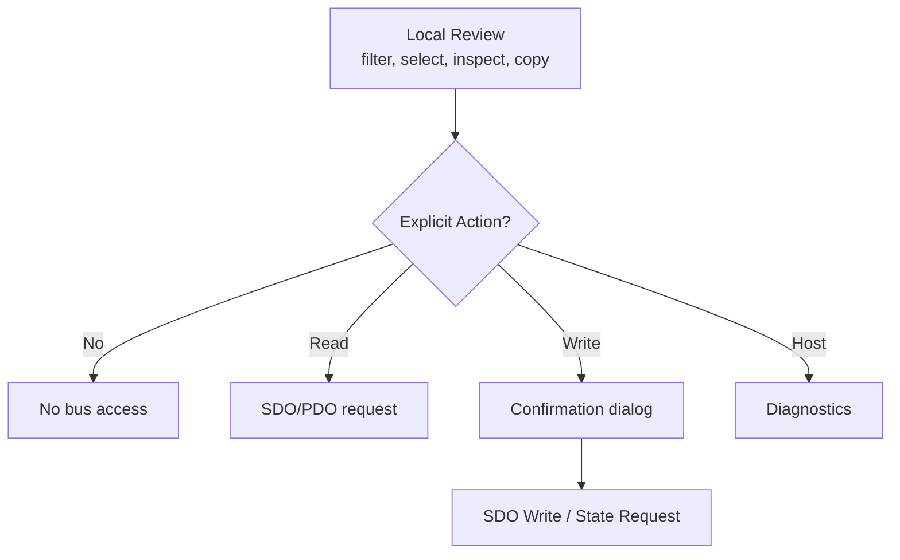

# NekoEcat Studio Architecture

## Overview

NekoEcat Studio is a modern EtherCAT engineering workstation for Linux, built on the IgH EtherCAT Master stack. The codebase uses C++20, Qt6, and CMake 3.20+. It is separated into four logical layers:

| Layer | Location | Purpose |
|-------|----------|---------|
| GUI | `apps/ecat-studio` | Qt6 desktop application with plugin-based workspace tabs |
| Daemon | `apps/ecatd` | Local TCP server that wraps IgH CLI tools and ecrt |
| Core Types | `src/core` | Shared domain types and JSON framing protocol |
| IgH Adapter | `src/igh` | Parses IgH `ethercat` CLI stdout into structured objects |

## System Architecture

```
Engineer ──► ecat-studio (Qt6 GUI)
                │
                │ JSON-RPC / TCP : 5877
                ▼
             ecatd (Daemon)
                │
                │ IgH ethercat CLI / ecrt API
                ▼
          IgH EtherCAT Master
                │
                ▼
            EtherCAT Bus
```

### Dependency Direction

```
src/core  (no deps)
    ▲
    │
src/igh   (depends on core)
    ▲
    │
apps/ecatd  (depends on core + igh)

apps/ecat-studio  (depends on core only; talks to daemon via TCP)
```

- `src/core` is the foundation — domain types (`SlaveInfo`, `JsonProtocol`) with zero external dependencies beyond Qt6::Core.
- `src/igh` depends on `ecat_core` and wraps the IgH `ethercat` CLI, parsing stdout into `QVector<SlaveInfo>` and structured results.
- `apps/ecatd` links `ecat_core`, `ecat_igh`, and the `ethercat` system library. It runs a local TCP server and dispatches JSON commands.
- `apps/ecat-studio` links only `ecat_core`. It communicates with the daemon exclusively over TCP using `EcatClient`.

## Plugin System

The GUI uses a plugin architecture where each workspace tab is a self-contained `WorkspacePlugin` implementation. Plugins register with a central `PluginRegistry` and communicate through an `EventBus`.

### WorkspacePlugin Interface

**File**: `apps/ecat-studio/plugins/WorkspacePlugin.h`

All workspace tabs inherit from `WorkspacePlugin` (which extends `QObject`) and implement:

#### Identity
| Method | Return | Purpose |
|--------|--------|---------|
| `id()` | `QString` | Unique plugin identifier (e.g. `"overview"`, `"od"`, `"watch"`) |
| `displayName()` | `QString` | English tab label |
| `displayNameZh()` | `QString` | Chinese tab label |
| `icon()` | `QIcon` | Tab icon (default: empty) |

#### UI
| Method | Return | Purpose |
|--------|--------|---------|
| `widget()` | `QWidget*` | The plugin's main content widget |
| `defaultOrder()` | `int` | Tab ordering priority (lower = leftward) |
| `visible()` | `bool` | Whether the tab should be shown |

#### Lifecycle
| Method | Purpose |
|--------|---------|
| `activate()` | Called when the tab becomes active |
| `deactivate()` | Called when the tab is hidden |
| `onSettingsChanged(const AppSettings&)` | Settings dialog was applied |
| `onConnectionChanged(bool connected)` | Daemon connection state changed |

#### Signals
| Signal | Parameters | Purpose |
|--------|-----------|---------|
| `requestNavigate` | `const QString &pluginId` | Request navigation to another plugin tab |
| `updateDiagnostics` | `level, source, msg` | Report a diagnostic event to the Diagnostics panel |

### PluginRegistry

**File**: `apps/ecat-studio/plugins/PluginRegistry.h`

Central registry that manages all workspace plugins. Provides ordered access, id-based lookup, and visibility filtering.

| Method | Purpose |
|--------|---------|
| `registerPlugin(WorkspacePlugin*)` | Add plugin to registry (validates null, empty id, duplicate id) |
| `count()` | Number of registered plugins (including hidden ones) |
| `pluginAt(int)` | Ordered access by index (sorted by defaultOrder ascending) |
| `findById(QString)` | O(log n) id-based lookup via QMap |
| `visiblePlugins()` | Filtered list of visible plugins (in sorted order) |

Internal storage: `QVector<WorkspacePlugin*>` for ordered traversal (sorted by defaultOrder), `QMap<QString, WorkspacePlugin*>` for O(log n) id lookup. Both containers store the same plugin pointers (redundant for performance).

**Thread Safety**: Main (GUI) thread only. Registry is populated during MainWindow initialization and is effectively read-only after that phase.

**Registration Process**:
1. Plugin is validated (not null, non-empty id, no duplicate id)
2. Plugin is added to the internal vector and map
3. Vector is sorted by defaultOrder() to maintain consistent tab order
4. MainWindow uses the registry to create tabs in the correct order

### Registered Plugins

The GUI registers the following plugins in `MainWindow.cpp`. All are compiled
into the default application build; `Visible` marks the plugins that contribute
a workspace tab (the rest are hidden helper/preference plugins).

| Plugin | Id | Purpose | Visible |
|--------|----|---------|---------|
| OverviewPlugin | `overview` | Bus summary and slave overview | Yes |
| TopologyPlugin | `topology` | Topology graph visualization | Yes |
| OdPlugin | `od` | Object Dictionary browser | Yes |
| WatchPlugin | `watch` | SDO watch list with polling | Yes |
| FreeRunPlugin | `freerun` | Process data Free Run mode | Yes |
| DcSyncPlugin | `dcsync` | DC sync diagnostics | Yes |
| AlEventPlugin | `alevent` | AL event log viewer | Yes |
| StateMachinePlugin | `statemachine` | Slave state machine control | Yes |
| StartupSdoPlugin | `startupsdo` | Startup SDO configuration | Yes |
| IoVariablePlugin | `iovariable` | I/O variable monitoring | Yes |
| ConsistencyPlugin | `consistency` | Bus consistency checks | Yes |
| DiagnosticsPlugin | `diagnostics` | Host and bus diagnostics | Yes |
| SessionPlugin | `session` | Session management | Yes |
| SignalPlugin | `signal` | Multi-channel signal analyzer | Yes |
| EsiBrowserPlugin | `esibrowser` | ESI XML browser, parser, and device matcher | Yes |
| BusStatsPlugin | `busstats` | Bus statistics monitoring | Yes |
| OscilloscopePlugin | `oscilloscope` | Real-time multi-channel waveform display | Yes |
| EoEPlugin | `eoe` | Ethernet over EtherCAT (EoE) tunnel | Yes |
| SoEPlugin | `soe` | Servo over EtherCAT (SoE) interface | Yes |
| EniExportPlugin | `eni` | ENI export | Yes |
| ProjectPlugin | `project` | Project management and configuration | Yes |
| PdoMappingEditorPlugin | `pdomapping` | Visual PDO mapping editor with canvas, validator, and export | Yes |
| DcSyncPrecisionPlugin | `dcsyncprecision` | DC sync precision analysis with drift/jitter monitoring | Yes |
| OnlineDiagnosticsPlugin | `onlinediagnostics` | Real-time bus monitoring, error analysis, health scoring | Yes |
| RtTestPlugin | `rttest` | Real-time performance testing | No |
| ExportPlugin | `export` | Data export | No |
| NotesPlugin | `notes` | User notes | No |
| ChartPlugin | `chart` | Data visualization (line, bar, pie, scatter, gauge) | No |
| ProtocolAnalyzerPlugin | `protocol` | EtherCAT protocol frame capture and analysis | No |
| ThemeCustomizerPlugin | `themecustomizer` | UI theme customization | No |
| KeyboardShortcutsPlugin | `shortcuts` | Keyboard shortcut configuration | No |
| UserPreferencesPlugin | `preferences` | User preference management | No |
| AutomationPlugin | `automation` | JavaScript script editor and execution (Qt6 Qml) | No |
| RealtimePerformancePlugin | `realtimeperf` | Latency and throughput monitoring with ring buffer statistics | No |

That is **34 plugins registered** in the default build, of which **24 are
visible** as workspace tabs. (The `AutomationPlugin` registration is wrapped in
`#ifdef ECAT_SCRIPTING_ENABLED`, so a build without `Qt6::Qml` registers 33
plugins, all still 24 visible.) The `AlarmPlugin` is compiled and registered
only when `ECAT_EXPERIMENTAL_SERVICES=ON`; several of the plugins above
(`RtTestPlugin`, `ExportPlugin`, `NotesPlugin`, `ChartPlugin`,
`ProtocolAnalyzerPlugin`, `ThemeCustomizerPlugin`, `KeyboardShortcutsPlugin`,
`UserPreferencesPlugin`, `RealtimePerformancePlugin`) are registered but report
`visible() == false` and contribute no tab. The **visible** workspace tabs are:
Overview, Topology, Object Dictionary, Watch, Free Run, DcSync, AlEvent,
StateMachine, StartupSdo, IoVariable, Consistency, Diagnostics, Session,
Signal, EsiBrowser, BusStats, Oscilloscope, EoE, SoE, EniExport, Project,
PdoMappingEditor, DcSyncPrecision, OnlineDiagnostics.

> Note: many additional plugin directories exist on disk (Dashboard, Trace,
> LogicAnalyzer, Diagram, Formula, Simulation, Calibration, Documentation,
> Wizard, MultiMaster, AdvancedErrorAnalysis, HardwareVerification, the
> various *Optimizer plugins, and the workflow/dashboard editors). They are
> **not** part of the default application build; their unit tests are only
> compiled when `ECAT_EXPERIMENTAL_SERVICES=ON`.

### EventBus

**File**: `apps/ecat-studio/services/EventBus.h`

Central signal hub for inter-plugin communication. Plugins emit and receive events through the bus rather than knowing about each other directly. This decouples plugins and enables independent development.

**Architecture**: EventBus implements a publish/subscribe (pub/sub) pattern. Producers (services) emit events via convenience wrapper methods, and consumers (plugins) subscribe via Qt signal-slot connections. All subscribers receive all events (no filtering or routing).

| Signal | Parameters | Purpose |
|--------|-----------|---------|
| `slaveChanged` | `QVector<SlaveInfo>` | Topology scan results available |
| `sdoValueReceived` | `int pos, QString idx, QString sub, QString val` | SDO read result |
| `connectionStateChanged` | `bool connected` | Daemon connect/disconnect |
| `freeRunTelemetry` | `QJsonObject` | Free Run process data snapshot |
| `topologyChanged` | `QVector<SlaveInfo>` | Topology change detected (diff from baseline) |
| `dcSyncUpdate` | `QJsonObject` | DC sync status per slave |
| `alEvent` | `QJsonObject` | AL event log entry |
| `signalData` | `int channel, QVector<double>, QVector<qint64>` | Multi-channel signal data |

Emitter methods (`emitSlaveChanged`, `emitSdoValue`, etc.) wrap the Qt signal emission for type-safe dispatch. Each method simply emits the corresponding signal, providing a clean API boundary.

**Thread Safety**: All event emission and subscription should happen on the main (GUI) thread. Services that do background I/O must marshal results to the main thread before emitting through EventBus.

**Performance Notes**: Signal emission is O(n) where n is the number of connected slots. For high-frequency events (e.g., signalData at 1kHz), producers should consider batching or throttling. Signal parameters use const references to minimize data copying.

### ServiceContainer

**File**: `apps/ecat-studio/services/ServiceContainer.h`

Dependency injection container holding all service instances. Passed to plugins at construction time so they can access domain services without knowing about `MainWindow` or `EcatClient` directly.

**Ownership Model**: All service pointers and the EcatClient are created as QObject children of this container. Qt's parent-child tree handles deletion automatically — no manual cleanup, no smart pointers, no RAII wrappers needed.

**Lifetime**: A single ServiceContainer is created in MainWindow's constructor and lives for the entire application lifetime. It is never replaced or rebuilt at runtime.

**Dependency Injection**: The container is passed to each WorkspacePlugin constructor. Plugins access services via accessor methods (e.g., `container_->sdo()`, `container_->eventBus()`). This keeps plugins decoupled from the GUI coordinator and allows services to be mocked or replaced in tests.

**Thread Safety**: ALL access to the container and its services is expected from the main (GUI) thread only. Services that perform background I/O marshal their results back to the main thread via Qt signals before reaching this container.

**Initialization Order**: Services are created in dependency order:
1. Infrastructure (EcatClient, EventBus) — no dependencies
2. Core services (Sdo, Watch, Topology) — depend on EcatClient
3. Hardware services (DcSync, AlEvent) — depend on EcatClient
4. Monitoring services — depend on EventBus + EcatClient
5. Composite services — depend on multiple services
6. Data services — mostly standalone
7. Advanced services — depend on EventBus + EcatClient

| Accessor | Type | Purpose |
|----------|------|---------|
| `client()` | `EcatClient*` | TCP client to ecatd |
| `eventBus()` | `EventBus*` | Inter-plugin signal hub |
| `sdo()` | `SdoService*` | SDO read/write operations |
| `watch()` | `WatchService*` | Watch list management |
| `topology()` | `TopologyService*` | Bus scanning and baseline |
| `dcSync()` | `DcSyncService*` | DC sync polling |
| `alEvent()` | `AlEventService*` | AL event log polling |
| `signal()` | `SignalService*` | Signal channel management |
| `perfMonitor()` | `PerformanceMonitorService*` | Performance metrics |
| `esi()` | `EsiService*` | ESI XML repository |
| `busStats()` | `BusStatsService*` | Bus statistics monitoring |
| `watchdog()` | `WatchdogService*` | Watchdog status monitoring |
| `safety()` | `SafetyController*` | Safety boundary validation |
| `diagnosticReport()` | `DiagnosticReportService*` | Diagnostic report generation |
| `projectManager()` | `ProjectManagerService*` | Project lifecycle management |
| `configuration()` | `ConfigurationService*` | Configuration management |
| `chart()` | `ChartService*` | Chart data management |
| `batch()` | `BatchOperationService*` | Batch SDO/state operations |
| `networkDiagnostics()` | `NetworkDiagnosticsService*` | Network port health and error monitoring |
| `ecatHealth()` | `EcatHealthService*` | EtherCAT health score and state monitoring |
| `exportService()` | `ExportService*` | Data export functionality |
| `firmwareUpdate()` | `FirmwareUpdateService*` | Firmware update operations |
| `reportGenerator()` | `ReportGeneratorService*` | Report generation |
| `dcSyncPrecision()` | `DcSyncPrecisionService*` | DC sync precision analysis |
| `sdoCache()` | `SdoCacheService*` | Per-slave SDO cache management |
| `pdoMapping()` | `PdoMappingService*` | PDO mapping discovery and validation |
| `coe()` | `CoEService*` | CANopen over EtherCAT protocol |
| `foe()` | `FoEService*` | File over EtherCAT protocol |
| `eoe()` | `EoEService*` | Ethernet over EtherCAT protocol |
| `stateMachine()` | `StateMachineService*` | Slave state machine control |
| `errorHandling()` | `ErrorHandlingService*` | Error detection and recovery |
| `hotConnect()` | `HotConnectService*` | Hot connect group management |
| `redundancy()` | `RedundancyService*` | EtherCAT redundancy management |
| `onlineDiagnostics()` | `OnlineDiagnosticsService*` | Real-time bus monitoring and diagnostics |
| `realtimePerformance()` | `RealtimePerformanceService*` | Real-time performance monitoring |
| `freeRunConfig()` | `FreeRunConfigurationService*` | Free Run configuration |
| `freeRunMonitor()` | `FreeRunMonitoringService*` | Free Run monitoring |
| `pdoConfiguration()` | `PdoConfigurationService*` | PDO configuration |
| `opState()` | `OpStateService*` | Operational state management |
| `oscilloscope()` | `OscilloscopeService*` | Oscilloscope signal capture |
| `protocolAnalyzer()` | `ProtocolAnalyzerService*` | Protocol analysis |

That is **41 accessors** in the default build: `EcatClient` + `EventBus` plus
**39 domain services**. `ScriptingService` is available only when
`ECAT_SCRIPTING_ENABLED` is defined (requires Qt6::Qml); `AlarmService` and
`LoggingService` only when `ECAT_EXPERIMENTAL_SERVICES=ON`. Earlier revisions of
this document claimed 85+ services; the shipped count is what `ServiceContainer`
actually constructs.

## Service Layer

The services below are compiled into the default application build and
instantiated by `ServiceContainer` (39 domain services plus `EcatClient` and
`EventBus`). Earlier revisions of this document listed 85+ services; the
experimental/optimization/analytics/workflow/dashboard services that still exist
as source files are **not** compiled or registered unless
`ECAT_EXPERIMENTAL_SERVICES=ON` (which adds `AlarmService` and `LoggingService`).

| Service | File | Purpose |
|---------|------|---------|
| `EcatClient` | `infra/EcatClient.h` | TCP client to ecatd (JSON-RPC) |
| `EventBus` | `services/EventBus.h` | Central inter-plugin signal hub |
| `SdoService` | `services/SdoService.h` | SDO upload/download, dictionary caching, evidence tracking |
| `WatchService` | `services/WatchService.h` | Watch list management, periodic polling, drift detection |
| `TopologyService` | `services/TopologyService.h` | Bus scanning, slave info, baseline capture/diff |
| `DcSyncService` | `services/DcSyncService.h` | DC sync diagnostics polling |
| `AlEventService` | `services/AlEventService.h` | AL event log polling and clearing |
| `SignalService` | `services/SignalService.h` | Multi-channel signal subscriptions and stats |
| `PerformanceMonitorService` | `services/PerformanceMonitorService.h` | Cycle time, jitter, frame loss metrics (ring buffer) |
| `EsiService` | `services/EsiService.h` | ESI XML import/parse, device matching, PDO lookup |
| `BusStatsService` | `services/BusStatsService.h` | Bus frame counts, error counts, bandwidth |
| `WatchdogService` | `services/WatchdogService.h` | Watchdog timeout monitoring per slave |
| `SafetyController` | `services/SafetyController.h` | Safety boundary validation for transitions, SDO writes, Free Run |
| `DiagnosticReportService` | `services/DiagnosticReportService.h` | Diagnostic reports in Markdown/CSV |
| `ProjectManagerService` | `services/ProjectManagerService.h` | Project lifecycle with .ecatproj files |
| `ConfigurationService` | `services/ConfigurationService.h` | Master/slave/network/timing configuration |
| `ChartService` | `services/ChartService.h` | Chart data management |
| `BatchOperationService` | `services/BatchOperationService.h` | Batch SDO/state/topology operations |
| `AsyncOperationManager` | `services/AsyncOperationManager.h` | Priority-queued async operations with timeout/progress |
| `NetworkDiagnosticsService` | `services/NetworkDiagnosticsService.h` | Network port health, error counters, latency |
| `EcatHealthService` | `services/EcatHealthService.h` | EtherCAT health score (0-100) |
| `ExportService` | `services/ExportService.h` | Data export to file/external formats |
| `FirmwareUpdateService` | `services/FirmwareUpdateService.h` | Firmware update via FoE |
| `ReportGeneratorService` | `services/ReportGeneratorService.h` | Report generation |
| `DcSyncPrecisionService` | `services/DcSyncPrecisionService.h` | DC sync drift/jitter analysis |
| `SdoCacheService` | `services/SdoCacheService.h` | Per-slave SDO dictionary/value cache |
| `PdoMappingService` | `services/PdoMappingService.h` | PDO mapping discovery, validation, export |
| `CoEService` | `services/CoEService.h` | CANopen over EtherCAT (SDO info, dictionary, emergency) |
| `FoEService` | `services/FoEService.h` | File over EtherCAT |
| `EoEService` | `services/EoEService.h` | Ethernet over EtherCAT |
| `StateMachineService` | `services/StateMachineService.h` | Slave state machine control |
| `ErrorHandlingService` | `services/ErrorHandlingService.h` | Error detection and recovery |
| `HotConnectService` | `services/HotConnectService.h` | Hot connect group management |
| `RedundancyService` | `services/RedundancyService.h` | EtherCAT redundancy management |
| `OnlineDiagnosticsService` | `services/OnlineDiagnosticsService.h` | Real-time bus monitoring and health scoring |
| `RealtimePerformanceService` | `services/RealtimePerformanceService.h` | Latency/throughput monitoring |
| `FreeRunConfigurationService` | `services/FreeRunConfigurationService.h` | Free Run configuration |
| `FreeRunMonitoringService` | `services/FreeRunMonitoringService.h` | Free Run monitoring |
| `PdoConfigurationService` | `services/PdoConfigurationService.h` | PDO configuration |
| `OpStateService` | `services/OpStateService.h` | Operational state management |
| `OscilloscopeService` | `services/OscilloscopeService.h` | Oscilloscope signal capture |
| `ProtocolAnalyzerService` | `services/ProtocolAnalyzerService.h` | Protocol analysis |
| `ImpactAnalysisService` | `services/ImpactAnalysisService.h` | Impact analysis for Free Run/state transitions |
| `ScriptingService` | `services/ScriptingService.h` | Automation scripting (only if `ECAT_SCRIPTING_ENABLED`) |

### Native IgH API Backend

`EthercatNativeBackend` 实现了 `EcatService` 接口，使用 ecrt API 直接与 IgH EtherCAT Master 通信：

- **优势**: 已覆盖路径无 CLI 进程开销，现场延迟取决于 IgH 版本、主站状态和从站响应
- **限制**: 某些操作（如 SDO 字典枚举和 ESI XML 访问）仍需 CLI 后端
- **自动选择**: Daemon 启动时自动检测并选择最佳后端

关键 ecrt API 函数：
- `ecrt_open_master()` - 打开主站
- `ecrt_master_reserve()` - 预留主站
- `ecrt_master_sdo_upload/download()` - SDO 读写
- `ecrt_master_get_slave()` - 获取从站信息

### Dual-Backend Mode

应用程序支持三种后端模式：
- **Auto**: 自动检测并选择最佳后端
- **Native**: 强制使用原生 API
- **CLI**: 强制使用命令行后端

模式切换通过 `setBackend` JSON 命令实现。

## Daemon Architecture (ecatd)

### Overview

The daemon is a local TCP server on `127.0.0.1:5877`. It accepts newline-delimited JSON requests and returns JSON responses. Each request has an `id` (for correlation), a `method` (string command name), and `params` (object).

**Protocol**: Newline-delimited JSON (`\n`-terminated frames).

**Request format**:
```json
{"id": "1", "method": "scan", "params": {"master": "0"}}
```

**Response format**:
```json
{"id": "1", "ok": true, "result": {"slaves": [...]}}
{"id": "1", "ok": false, "error": {"message": "...", "code": -1}}
```

### CommandDispatcher

**Files**: `apps/ecatd/CommandDispatcher.h`, `apps/ecatd/CommandDispatcher.cpp`

String-keyed dispatch table using `std::unordered_map<std::string, std::function>`. Each handler receives `(id, params)` and returns a complete JSON response object. O(1) hash-based routing replaces monolithic if/else chains.

```cpp
using Handler = std::function<QJsonObject(const QString &id, const QJsonObject &params)>;
void registerHandler(const QString &method, Handler handler);
QJsonObject dispatch(const QJsonObject &request) const;
```

### Handler Architecture

**File**: `apps/ecatd/EcatDaemon.cpp`

`EcatDaemon` owns all handler components:

```
EcatDaemon
  ├── CommandDispatcher        (routes method → handler lambda)
  ├── EthercatCliBackend       (EcatService impl; wraps IgH CLI)
  ├── FreeRunController        (ecrt-based process image I/O at ~1kHz, SCHED_FIFO + TIMER_ABSTIME)
  ├── freeRun_shm_mirror       (mirrorToShm: publishes process image to POSIX SHM)
  ├── freeRun_rpc_handlers     (freeRunStart/Stop/Status/ShmInfo dispatch)
  ├── RtTestController         (real-time latency testing)
  ├── DcSyncHandler            (DC sync status, configuration, activation, deactivation)
  ├── AlEventHandler           (AL event log; polled every 1s)
  ├── AdapterHandler           (network adapter discovery/selection)
  ├── FoEHandler               (File over EtherCAT firmware read/write, path-allowlisted)
  └── SignalHandler            (signal subscription/polling)
```

The daemon accepts multiple TCP clients simultaneously (per-socket line buffers for reassembly across TCP fragmentation).

### JSON-RPC Methods

| Method | Params | Description |
|--------|--------|-------------|
| `ping` | — | Returns daemon name, version, multiMaster flag, uptime, request/error counts, active connections |
| `master` | `master` | Master status text |
| `scan` | `master` | Scan bus and return all slaves |
| `rescan` | `master` | Force bus rescan |
| `slaveInfo` | `master, position` | Detailed slave information |
| `pdos` | `master, position` | PDO mapping for a slave |
| `sdos` | `master, position` | SDO dictionary for a slave |
| `xml` | `master, position` | ESI XML for a slave |
| `upload` | `master, position, index, subIndex` | Read an SDO value |
| `download` | `master, position, index, subIndex, value, type` | Write an SDO value |
| `applyStartupSdos` | `master, items[]` | Batch-apply startup SDOs |
| `setState` | `master, position, state` | Set slave state (INIT/PREOP/SAFEOP/OP) |
| `setAllStates` | `master, state` | Set all slaves to a state |
| `freeRunStart` | `master` | Start ecrt Free Run mode |
| `freeRunStop` | — | Stop Free Run mode |
| `freeRunStatus` | — | Get Free Run telemetry |
| `freeRunShmInfo` | — | Get SHM name, data size, and process-image layout for the real-time client |
| `rtTestStart` | `master, cycleUsec` | Start real-time latency test |
| `rtTestStop` | — | Stop RT test |
| `rtTestStatus` | — | Get RT test telemetry |
| `dcSyncStatus` | `master` | DC sync diagnostics per slave |
| `dcConfigure` | `master, position` | Query DC configuration from ESI XML |
| `dcActivate` | `master, refClockSlave` | Activate DC synchronization |
| `dcDeactivate` | `master` | Deactivate DC synchronization |
| `foeRead` | `master, position, filePath` | Read firmware from slave via FoE |
| `foeWrite` | `master, position, filePath, password` | Write firmware to slave via FoE |
| `alEventLog` | `limit` | Retrieve AL event log entries |
| `alEventClear` | — | Clear AL event log |
| `listAdapters` | — | List network adapters |
| `setAdapter` | `name` | Select network adapter |
| `signalPoll` | `name, slave, index, subIndex` | Poll a signal value |
| `signalSubscribe` | `name, slave, index, subIndex` | Subscribe to a signal channel |
| `signalUnsubscribe` | `channelId` | Unsubscribe from a signal channel |
| `hostDiagnostics` | — | Host health checks |

## Real-Time Shared-Memory Data Plane

The real-time path for process data bypasses TCP/JSON entirely for the hot loop.
The daemon's `FreeRunController` owns an ecrt process-data domain in real-time
(`SCHED_FIFO`, ~1 kHz); the SHM mirror publishes a constant-size snapshot of that
image into POSIX shared memory each cycle for any external process to consume.

**Canonical ABI header**: `src/core/nekoecat_shm.h`. This Qt-free, plain-C
header is the single source of truth for the layout shared between the C++ daemon
and the pure-C client (`client/nekoecat_client.c`). It defines `ShmHeader`,
daemon-side `ShmMirrorEntry`/`ShmMirrorContext`, client-side `ShmLayoutEntry`/
`ShmLayout`, cross-process atomics (C11/GCC `__atomic` helpers), and
compile-time `static_assert`s that fail the build if the two sides drift.

**SHM region layout** (`/nekoecat_proc_0`):

```
[ ShmHeader (56 bytes) ]
[ data buffer 0  — stride = data_size, cap NEKOECAT_SHM_MAX_PROCESS_DATA_SIZE (4096) ]
[ data buffer 1  — stride = data_size                                        ]
```

`ShmHeader` fields (`version`, `cycle_count`, `timestamp_ns`, `active_buffer`,
`data_size`, `layout_version`, `status_flags`, `ignored_writes`, `reserved`) are
POD and are always touched through the atomic helpers.

### Double buffer + publish order

Each cycle (`mirrorToShm` in `apps/ecatd/freerun_shm_mirror.cpp`):

1. Copy the fresh inputs from the ecrt domain into the **inactive** buffer.
2. Overlay validated client outputs (RxPDO) from the **active** buffer back into
   the inactive buffer AND into the daemon `domainData` (last-write-wins), so the
   next ecrt `send` carries them. Out-of-range client writes are ignored and
   counted into `ignored_writes`.
3. **Publish atomically**, in this order:
   `timestamp_ns` → `status_flags` (mark `NEKOECAT_FLAG_RUNNING`) →
   `cycle_count` (all relaxed) → `active_buffer` (release) → `version` (final
   release). `active_buffer` flips to the freshly-written buffer; `version` is
   bumped last. Because `version` is a release store, any reader that acquires it
   is guaranteed to observe every preceding cyclic update.

The publish order is chosen so a weakly-ordered reader can rely on it: a client
that `acquire`s `version` gets a consistent, torn-free view of one complete cycle.

### Client attach + double-read

`nekoecat_client_attach()` (`client/nekoecat_client.c`) locates the SHM arena
(`freeRunShmInfo` RPC or a caller-provided layout JSON), validates the layout
version and size, and `mmap`s both data buffers plus the header. Access is via
the classic double-read protocol:

1. `acquire` `version` (call it V).
2. Read `active_buffer` and the data buffer.
3. `acquire` `version` again; if it still equals V the view is stable and safe to
   use; otherwise retry (a publish happened mid-read).

Typed reads (`read_u8/u16/u32/u64/float_by_index`, `read_*_at`) always bounds-check
against `data_size` and go through this protocol. Writes validate `0 ≤ off` and
`off + width ≤ data_size` and land directly in SHM for the daemon to overlay.
The client tracks `NEKOECAT_STATE_DATA_STALE` when a cycle is missed or the
published `version`/size stop advancing. Raw zero-copy access is available via
`nekoecat_client_get_process_data_ptr()`/`_get_current_version()`/`_get_data_size()`.

### Client library and install

`client/CMakeLists.txt` builds a standalone static library `libnekoecat_client.a`
(`nekoecat_client.c/.h`, `shm_layout.h`, and the canonical `nekoecat_shm.h`).
The Python example `examples/realtime/nekoecat_client_example.py` demonstrates raw
`mmap`+`ctypes` access and a ctypes wrapper of the C library. Install rules place
the library in `lib/` and `nekoecat_client.h`, `shm_layout.h`, `nekoecat_shm.h`
in `include/nekoecat`.

## Data Flow

### Topology Scan Flow

```
User clicks "Scan"
    → TopologyService::scan()
    → EcatClient::scan()
    → TCP → EcatDaemon
    → CommandDispatcher → "scan" handler
    → EthercatCliBackend::scanSlaves()
    → spawns `ethercat slaves` CLI
    → parses stdout into QVector<SlaveInfo>
    → JSON response → EcatClient
    → EcatClient::slavesChanged signal
    → TopologyService stores slaves
    → EventBus::emitSlaveChanged()
    → all connected plugins update
```

### SDO Read Flow

```
User selects object in Object Dictionary
    → OdPlugin triggers SdoService::upload()
    → EcatClient::upload(pos, idx, sub)
    → TCP → EcatDaemon
    → "upload" handler
    → EthercatCliBackend::upload()
    → spawns `ethercat upload` CLI
    → returns value string
    → JSON response → EcatClient::sdoValue signal
    → SdoService → EventBus::emitSdoValue()
    → OdPlugin and WatchPlugin update
```

### Free Run Flow

```
User clicks "Start Free Run"
    → EcatClient::freeRunStart()
    → TCP → EcatDaemon
    → "freeRunStart" handler
    → FreeRunController::start(masterIndex)
    → ecrt-based cyclic task at ~1kHz
    → periodic telemetry JSON pushed back
    → EcatClient::freeRunTelemetry signal
    → EventBus::emitFreeRunTelemetry()
    → FreeRunPlugin updates chart
```

### Signal Analyzer Flow

```
User subscribes to a signal
    → EcatClient → "signalSubscribe" → SignalHandler
    → returns channelId
    → SignalService starts polling
    → EcatClient → "signalPoll" → SignalHandler
    → reads process data value
    → EventBus::emitSignalData(channel, values, timestamps)
    → SignalService accumulates + computes stats
    → SignalPlugin updates chart
```

### PDO Mapping Editor Flow

```
User opens PDO Mapping Editor
    → PdoMappingService::discoverMappings(pos)
    → EcatClient → "pdos" → EcatDaemon
    → EthercatCliBackend::readPdos()
    → parses SM/PDO structure
    → JSON response → PdoMappingService
    → PdoMappingEditorPlugin renders canvas
    → User drags entries to configure mapping
    → PdoMappingValidator validates configuration
    → SDO write to apply mapping
```

### Online Diagnostics Flow

```
User opens Online Diagnostics
    → OnlineDiagnosticsService::startMonitoring()
    → EcatClient → "hostDiagnostics" + periodic polling
    → BusMonitorWidget displays frame counts, error rates
    → ErrorAnalyzerWidget tracks error patterns
    → Health score computed from multiple metrics
    → EventBus::emitTopologyChanged() triggers re-evaluation
```

### DC Sync Optimization Flow

```
User opens DC Sync Optimization
    → DcSyncOptimizationService analyzes current DC sync parameters
    → SyncOptimizationWidget displays sync optimization recommendations
    → DriftOptimizationWidget shows drift reduction suggestions
    → JitterOptimizationWidget presents jitter minimization options
    → ConfigOptimizationWidget recommends configuration changes
    → User applies optimization → SDO write to apply parameters
```

### Free Run Optimization Flow

```
User opens Free Run Optimization
    → FreeRunOptimizationService analyzes cycle time and data mapping
    → CycleTimeOptimizerWidget displays cycle time optimization
    → DataMappingOptimizerWidget shows data mapping improvements
    → Performance optimization tab presents CPU/bus/frame metrics
    → Error handling optimization suggests recovery strategies
    → User applies optimization → configuration update
```

### SDO Optimization Flow

```
User opens SDO Optimization
    → SdoOptimizationService analyzes SDO communication patterns
    → CacheOptimizerWidget displays cache hit/miss optimization
    → BatchOptimizerWidget shows batch transfer improvements
    → Performance optimization presents throughput/latency metrics
    → Error handling optimization suggests retry strategies
    → User applies optimization → cache/batch configuration update
```

## How to Add a New Plugin

1. Create a new directory under `apps/ecat-studio/plugins/<name>/`
2. Implement `WorkspacePlugin` interface in `<Name>Plugin.h/.cpp`
3. Add the plugin source files to `apps/ecat-studio/CMakeLists.txt`
4. Register the plugin in `MainWindow` constructor
5. Create a service under `apps/ecat-studio/services/` if needed
6. Add service to `ServiceContainer` if other plugins need it
7. Use `EventBus` for inter-plugin communication

See `docs/PLUGIN_GUIDE.md` for a detailed step-by-step guide.

## Build Targets

| Target | Type | Location | Description |
|--------|------|----------|-------------|
| `ecat_core` | Static library | `src/core/` | Domain types (`SlaveInfo`, `JsonProtocol`) |
| `ecat_igh` | Static library | `src/igh/` | IgH CLI adapter (`EthercatCliBackend`) |
| `ecatd` | Executable | `apps/ecatd/` | Runtime daemon (TCP server, command dispatch) |
| `ecat-studio` | Executable | `apps/ecat-studio/` | Qt6 desktop GUI |
| `release-smoke` | CTest target | `tests/` | 15 core tests that must pass before release |

### Build Commands

```bash
cmake -B build -DCMAKE_BUILD_TYPE=Release
cmake --build build
cmake --build build --target release-smoke   # run release smoke tests
```

## Directory Layout

```
├── apps/
│   ├── ecatd/                    # Daemon
│   │   ├── EcatDaemon            #   TCP server + dispatch
│   │   ├── CommandDispatcher     #   String-keyed routing table
│   │   ├── FreeRunController     #   ecrt process image I/O
│   │   ├── RtTestController      #   Real-time latency testing
│   │   └── handlers/             #   Domain-specific handlers
│   │       ├── AdapterHandler    #     Network adapter discovery
│   │       ├── AlEventHandler    #     AL event log
│   │       ├── DcSyncHandler     #     DC sync status
│   │       └── SignalHandler     #     Signal subscription/polling
│   └── ecat-studio/              # GUI
│       ├── plugins/              #   Workspace plugin implementations
│       ├── services/             #   Domain services
│       ├── models/               #   Pure data/logic types
│       ├── adapters/             #   Model → QTableWidget bridge
│       ├── detail/               #   Detail panel text builders
│       ├── utils/                #   Reusable utilities
│       ├── infra/                #   EcatClient, settings, i18n
│       ├── themes/               #   Theme manager and resources
│       └── workspaces/           #   MainWindow partial implementations
├── src/
│   ├── core/                     # Shared types and protocol
│   └── igh/                      # IgH CLI backend
├── tests/                        # Unit and integration tests
├── translations/                 # Qt .ts files (8 languages)
├── scripts/                      # Build and utility scripts
├── tools/                        # Development tools
└── docs/                         # Documentation
```

## Performance Considerations

### Async Operations

`AsyncOperationManager` provides priority-queued async execution with:
- Configurable concurrency (default 4 concurrent operations)
- Priority levels: Low, Normal, High, Critical
- Timeout handling (default 30s per operation)
- Cancellation support with atomic flag checking
- Progress tracking and completion signals

### Memory Management

`MemoryPool<T>` provides fixed-size object pooling for frequent allocations:
- Pre-allocates a configurable pool (default 256 objects)
- Falls back to heap allocation on pool exhaustion
- Thread-safe via `QMutex`
- Tracks statistics: peak usage, overflow count, allocation/deallocation counts

### EventBus Optimization

EventBus uses Qt's direct signal-slot connections for same-thread dispatch.
For cross-thread scenarios, services marshal results to the main thread before
emitting through EventBus. Signal payloads use const references to minimize copying.

### Watchdog Monitoring

`WatchdogService` polls daemon at configurable intervals (default 1s) for
watchdog status. Per-slave tracking includes timeout counts, trigger counts,
and last trigger timestamps. Integrates with EventBus for topology change
notifications.

## Safety Model



`SafetyController` validates:
- State transitions (INIT → PREOP → SAFEOP → OP and reverse)
- SDO write permissions during Free Run
- Free Run start conditions (OP state required)

Dangerous operations require explicit confirmation with impact analysis showing
local evidence, topology context, and potential side effects.

## ServiceContainer Architecture

### Single EcatClient Design

The ServiceContainer uses a **single EcatClient instance** shared across all services. This design ensures:

- **Consistent connection state**: All services share one TCP connection to ecatd
- **Reduced resource usage**: No duplicate socket connections or buffers
- **Simplified lifecycle**: One client to connect, disconnect, and reconnect
- **Thread safety**: All EcatClient calls are marshaled to the GUI thread

```
ServiceContainer
  ├── EcatClient (single instance)
  │   ├── SdoService ──────── uses client()
  │   ├── TopologyService ─── uses client()
  │   ├── WatchService ────── uses client()
  │   ├── DcSyncService ───── uses client()
  │   └── ... (all services share the same client)
  └── EventBus (single instance)
```

### Service Registration

Services are created in dependency order during `ServiceContainer` construction:

1. **Infrastructure**: EcatClient, EventBus (no dependencies)
2. **Core services**: SdoService, WatchService, TopologyService (depend on EcatClient)
3. **Hardware services**: DcSyncService, AlEventService (depend on EcatClient)
4. **Monitoring services**: PerformanceMonitorService, WatchdogService (depend on EventBus + EcatClient)
5. **Composite services**: DiagnosticReportService, SafetyController (depend on multiple services)
6. **Data services**: ProjectManagerService, ConfigurationService (mostly standalone)
7. **Advanced services**: registered domain-specific services (depend on EventBus + EcatClient)

### Plugin Registration System

The `PluginRegistry` manages plugin lifecycle through a well-defined registration flow:

```
MainWindow constructor
  → creates ServiceContainer (single EcatClient + EventBus)
  → creates PluginRegistry
  → for each plugin type:
      1. Construct plugin with ServiceContainer reference
      2. Call registry.registerPlugin(plugin)
         a. Validate: not null, non-empty id, no duplicate id
         b. Add to QVector (ordered) and QMap (lookup)
         c. Sort QVector by defaultOrder()
      3. MainWindow creates tab widget from plugin->widget()
```

**Validation rules**:
- Plugin pointer must not be null
- Plugin id must not be empty
- Plugin id must not duplicate an existing registration

**Ordering**: Plugins are sorted by `defaultOrder()` ascending. Lower values appear leftward in the tab bar. Plugins with the same order maintain registration sequence.

## Error Handling Architecture

### Layered Error Strategy

```
┌─────────────────────────────────────────────┐
│ GUI Layer (plugins)                         │
│   → User-facing error dialogs               │
│   → Diagnostic event emission               │
│   → Graceful degradation (disable features) │
├─────────────────────────────────────────────┤
│ Service Layer                               │
│   → Error detection and classification      │
│   → Recovery action suggestions             │
│   → EventBus error notifications            │
├─────────────────────────────────────────────┤
│ Communication Layer (EcatClient)            │
│   → TCP connection error handling           │
│   → Automatic reconnection                  │
│   → Request timeout management              │
├─────────────────────────────────────────────┤
│ Daemon Layer (ecatd)                        │
│   → CLI error parsing                       │
│   → JSON error response formatting          │
│   → Handler-level try/catch                 │
└─────────────────────────────────────────────┘
```

### Error Flow

1. **Detection**: ErrorHandlingService monitors for communication failures, state violations, and timeout conditions
2. **Classification**: Errors are categorized by severity (Warning, Error, Critical) and type (Communication, Device, Network, Configuration)
3. **Notification**: EventBus emits error events; plugins subscribe and update UI accordingly
4. **Recovery**: SafetyController validates recovery actions; ErrorHandlingService suggests recovery steps
5. **Logging**: LoggingService records all errors with timestamps, categories, and context

### Safety Boundaries

- **State transitions**: SafetyController validates INIT→PREOP→SAFEOP→OP transitions
- **SDO writes**: Confirmation required for writes during Free Run mode
- **Free Run start**: Requires OP state; validated before ecrt activation
- **Dangerous operations**: Explicit confirmation dialogs with impact analysis

## Performance Monitoring

### Monitoring Architecture

```
┌──────────────────────────────────────────────┐
│ PerformanceMonitorService                    │
│   ├── Cycle time tracking (1000-sample ring) │
│   ├── Jitter measurement                     │
│   ├── Frame loss monitoring                  │
│   ├── SDO response time tracking             │
│   └── PDO update rate monitoring             │
├──────────────────────────────────────────────┤
│ BusStatsService                              │
│   ├── Frame counts (tx/rx/error)             │
│   ├── Bandwidth utilization                  │
│   ├── Error rate tracking                    │
│   └── Latency statistics                     │
├──────────────────────────────────────────────┤
│ WatchdogService                              │
│   ├── Per-slave watchdog status              │
│   ├── Timeout counting                       │
│   └── Trigger history                        │
├──────────────────────────────────────────────┤
│ NetworkDiagnosticsService                    │
│   ├── Port health monitoring                 │
│   ├── Error counter tracking                 │
│   └── Bandwidth/latency/jitter metrics       │
└──────────────────────────────────────────────┘
```

### Ring Buffer Strategy

Performance-critical services use fixed-size ring buffers:

| Service | Buffer Size | Metrics |
|---------|-------------|---------|
| PerformanceMonitorService | 1000 samples | Cycle time, jitter, frame loss |
| RealtimePerformanceService | 1000 samples | Latency, throughput |
| DcSyncPrecisionService | 1000 samples | Drift, jitter |
| SignalService | 10000 samples | Multi-channel signal data |

Ring buffers provide O(1) insertion and automatic old-data eviction, ensuring constant memory usage during long-running monitoring sessions.

### Health Scoring

`EcatHealthService` computes a 0-100 health score from:
- Master state (30%)
- Slave states (25%)
- DC sync quality (20%)
- AL event severity (15%)
- Watchdog status (10%)

## Testing Architecture

### Test Organization

```
tests/
├── *_test.cpp              # Unit tests (one per plugin/service/model)
├── integration/            # Integration tests
│   ├── daemon_lifecycle_test.cpp
│   ├── plugin_lifecycle_test.cpp
│   └── workflow_*_integration_test.cpp
├── performance/            # Performance benchmarks (~43 files)
│   └── *_performance_test.cpp
├── fixtures/               # Test fixtures
│   ├── PluginTestFixture.h/cpp
│   ├── ServiceTestFixture.h/cpp
│   └── UITestFixture.h/cpp
├── mocks/                  # Mock objects
│   ├── MockEcatClient.h/cpp
│   ├── MockEventBus.h/cpp
│   └── MockServiceContainer.h/cpp
└── utils/                  # Test utilities
    ├── TestDataGenerator.h/cpp
    ├── TestAutomation.h/cpp
    └── TestUtilities.h
```

### Test Categories

| Category | Count | Description |
|----------|-------|-------------|
| Unit | 143 | Core, services, plugins, models, adapters, detail, infra, utils, handlers |
| Integration | 11 | Daemon lifecycle, plugin lifecycle, protocol/event-bus/service integration |
| Performance | 25 | EventBus, data pipeline, device manager, sync manager, state machine, EtherCAT monitors |
| Workflow (subset) | 2 | Workflow optimizer + dashboard plugin integration |

The default `ctest` run reports **179 tests** (143 unit + 11 integration + 25
performance; the 2 workflow tests carry an additional `workflow` label that is a
subset of integration). All pass in the default build (Release,
`ECAT_EXPERIMENTAL_SERVICES=OFF`). Reaching the previously removed
experimental/optimization/dashboard tests requires configuring with
`-DECAT_EXPERIMENTAL_SERVICES=ON`.

### Mock Strategy

**MockEcatClient** (extends EcatClient):
- Records all method calls (scan, upload, download, etc.)
- Configurable canned responses for scan/SDO/error
- Manual signal triggering for simulating daemon responses
- Used by: service tests, plugin tests requiring EcatClient

**MockEventBus** (extends EventBus):
- Records all signal emissions with name and arguments
- Signal counting for assertion
- Configurable delay for timing tests
- Used by: plugin tests, integration tests

**MockServiceContainer** (extends ServiceContainer):
- Replaces real EcatClient and EventBus with mocks
- Provides mockClient() and mockEventBus() accessors
- Used by: all tests requiring ServiceContainer

### Test Fixtures

**PluginTestFixture**: Creates ServiceContainer + PluginRegistry for plugin lifecycle tests.

**ServiceTestFixture**: Provides simulateConnection(), simulateSlaveChange(), simulateSdoValue() for service-layer tests.

**UITestFixture**: Manages QWidget creation/destruction with offscreen rendering support.

### Running Tests

```bash
# All tests
ctest --test-dir build --output-on-failure

# Specific test
ctest --test-dir build -R plugin_registry_test --output-on-failure

# Parallel execution
ctest --test-dir build --output-on-failure -j4

# Release smoke (15 core tests)
cmake --build build --target release-smoke
```

### Test Environment

- **Headless execution**: `QT_QPA_PLATFORM=offscreen` for all widget tests
- **No daemon required**: MockEcatClient eliminates need for running ecatd
- **Per-test isolation**: Each test creates its own ServiceContainer/PluginRegistry
- **AUTOMOC**: Required for tests using Q_OBJECT macro