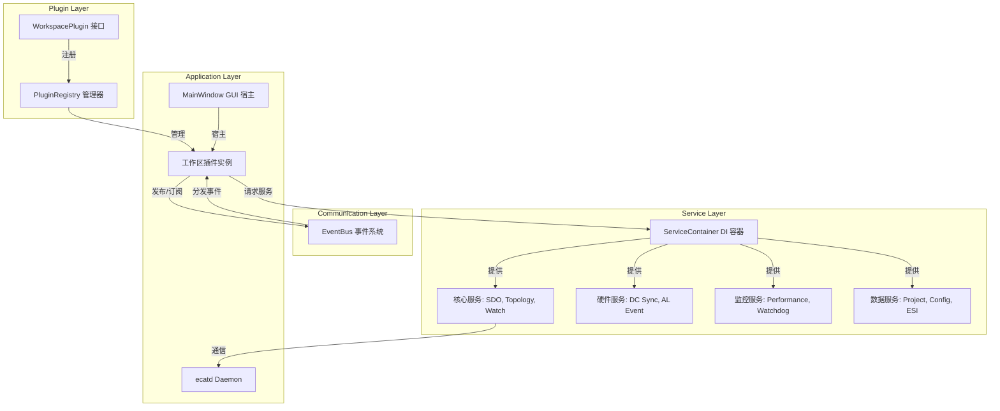

# NekoEcat Studio 项目全面梳理

**版本**: 3.7.0  
**梳理日期**: 2026-06-21  
**状态**: 活跃开发中

---

## 一、项目概览

### 1.1 项目定位

NekoEcat Studio 是一个面向 Linux + IgH EtherCAT Master 的现代工程工作站，目标是超越 TwinCAT 在性能和用户体验方面的表现。

### 1.2 核心特性

| 特性 | 说明 |
|------|------|
| **工程视角优先** | 按任务组织工作区，而非堆砌原始数据 |
| **证据驱动** | SDO 写入前汇总多源证据，确保一致性 |
| **危险边界清晰** | 本地操作不触发总线，在线操作需显式确认 |
| **插件化架构** | 94 个插件目录，实验插件默认关闭 |
| **双后端模式** | 支持原生 IgH API 和 CLI 两种后端 |

---

## 二、技术栈

| 组件 | 技术 | 版本 |
|------|------|------|
| **语言** | C++ | C++20 |
| **GUI 框架** | Qt | 6.x |
| **构建系统** | CMake | 3.20+ |
| **平台** | Linux | - |
| **EtherCAT** | IgH EtherCAT Master | 1.6.x |
| **许可证** | GPL v3.0 | - |

---

## 三、项目结构

### 3.1 目录布局

```
Ethercat/
├── apps/
│   ├── ecat-studio/          # Qt6 桌面 GUI
│   │   ├── main.cpp          # 入口点
│   │   ├── MainWindow.h/cpp  # 主窗口（partial-class 模式）
│   │   ├── models/           # 纯数据/逻辑类型（无 QWidget 依赖）
│   │   ├── adapters/         # 模型与 QTableWidget 桥接
│   │   ├── detail/           # 详情面板文本构建器
│   │   ├── utils/            # 可复用工具（表格、文本、UI）
│   │   ├── infra/            # TCP 客户端、共享类型、设置、i18n
│   │   ├── workspaces/       # MainWindow 的 partial 实现（31 个文件）
│   │   ├── plugins/          # 工作区插件（94 个目录，实验项默认关闭）
│   │   ├── services/         # 服务层（130+ 个服务）
│   │   ├── themes/           # UI 主题（12 个 .qss 文件）
│   │   └── translations/     # i18n 翻译文件（8 种语言）
│   └── ecatd/                # 本地运行时 Daemon
│       ├── main.cpp          # Daemon 入口点
│       ├── EcatDaemon.h/cpp  # TCP 服务器、命令分发
│       ├── CommandDispatcher.h/cpp  # O(1) 命令路由
│       ├── FreeRunController.h/cpp  # ecrt 实时过程数据 I/O
│       ├── RtTestController.h/cpp   # 实时时序测试
│       └── handlers/         # 领域特定处理器
├── src/
│   ├── core/                 # 共享领域类型和 JSON 协议
│   │   ├── EthercatTypes.h/cpp  # SlaveInfo, MasterInfo
│   │   ├── JsonProtocol.h/cpp   # 换行分隔 JSON 帧协议
│   │   └── EcatService.h        # 后端抽象接口
│   └── igh/                  # IgH EtherCAT Master 适配器
│       ├── EthercatCliBackend.h/cpp    # CLI 后端实现
│       └── EthercatNativeBackend.h/cpp # 原生 API 后端实现
├── tests/                    # 测试套件（361 个测试源文件，286 个默认稳定 CTest）
│   ├── CMakeLists.txt        # 测试构建配置
│   ├── fixtures/             # 测试夹具
│   ├── mocks/                # 模拟对象
│   ├── utils/                # 测试工具
│   ├── integration/          # 集成测试
│   └── performance/          # 性能测试
├── scripts/                  # 打包和工具脚本
├── tools/                    # 开发工具
├── docs/                     # 文档
├── translations/             # Qt .ts 翻译文件
├── CMakeLists.txt            # 顶层构建配置
├── README.md                 # 项目说明
├── CHANGELOG.md              # 变更日志
├── RELEASE_NOTES.md          # 发布说明
└── LICENSE                   # GPL v3.0 许可证
```

### 3.2 核心模块职责

| 模块 | 路径 | 职责 |
|------|------|------|
| **GUI** | `apps/ecat-studio` | Qt6 桌面应用，插件化工作区 |
| **Daemon** | `apps/ecatd` | 本地 TCP 服务器，命令分发 |
| **Core Types** | `src/core` | 共享领域类型和 JSON 协议 |
| **IgH Adapter** | `src/igh` | IgH CLI 和原生 API 适配器 |

---

## 四、架构设计

### 4.1 系统架构

```
┌─────────────────────────────────────────────────────────────┐
│                      NekoEcat Studio GUI                     │
│  ┌─────────┐  ┌─────────┐  ┌─────────┐  ┌─────────┐       │
│  │Overview │  │   OD    │  │  Watch  │  │FreeRun  │  ...  │
│  └────┬────┘  └────┬────┘  └────┬────┘  └────┬────┘       │
│       └────────────┼────────────┼────────────┘              │
│                    ▼            ▼                            │
│  ┌─────────────────────────────────────────────────────────┐│
│  │              ServiceContainer (DI 容器)                  ││
│  │  ┌─────────┐ ┌─────────┐ ┌─────────┐ ┌─────────┐      ││
│  │  │SdoService│ │Topology │ │  Watch  │ │EventBus │ ...  ││
│  │  └────┬────┘ └────┬────┘ └────┬────┘ └────┬────┘      ││
│  │       └───────────┼───────────┼───────────┘              ││
│  └───────────────────┼───────────┼─────────────────────────┘│
│                      ▼           ▼                          │
│  ┌─────────────────────────────────────────────────────────┐│
│  │                    EcatClient (TCP)                      ││
│  └───────────────────────────┬─────────────────────────────┘│
└──────────────────────────────┼──────────────────────────────┘
                               │ TCP:127.0.0.1:5877
                               ▼
┌──────────────────────────────────────────────────────────────┐
│                       ecatd Daemon                           │
│  ┌─────────────────────────────────────────────────────────┐│
│  │              CommandDispatcher (O(1) 路由)                ││
│  └───────────────────────────┬─────────────────────────────┘│
│                      ┌──────┴──────┐                        │
│                      ▼             ▼                        │
│  ┌──────────────────────┐  ┌──────────────────────┐        │
│  │  EthercatCliBackend  │  │EthercatNativeBackend │        │
│  │    (CLI 后端)        │  │   (原生 API 后端)    │        │
│  └──────────┬───────────┘  └──────────┬───────────┘        │
│             └────────────┬────────────┘                     │
│                          ▼                                  │
│  ┌─────────────────────────────────────────────────────────┐│
│  │              IgH EtherCAT Master                         ││
│  └───────────────────────────┬─────────────────────────────┘│
└──────────────────────────────┼──────────────────────────────┘
                               ▼
                     ┌──────────────────┐
                     │   EtherCAT Bus   │
                     └──────────────────┘
```

### 4.2 插件系统架构



### 4.3 双后端模式

| 模式 | 说明 | 使用场景 |
|------|------|----------|
| **Auto (推荐)** | 自动检测最佳后端 | 默认模式，优先原生 API |
| **IgH Native API** | 强制使用 ecrt API | 需要最高性能时 |
| **IgH CLI** | 强制使用命令行后端 | 兼容性问题时 |

---

## 五、代码统计

### 5.1 文件数量

| 类别 | 数量 | 说明 |
|------|------|------|
| **源文件总数** | 3,389 | git 跟踪的 .cpp + .h 文件 |
| **应用源文件** | ~1,000 | apps/ 目录下的 .cpp/.h |
| **测试文件** | 361 | git 跟踪的测试源文件 |
| **插件目录** | 94 | apps/ecat-studio/plugins/ |
| **服务文件** | 260 | apps/ecat-studio/services/ |
| **主题文件** | 12 | .qss 主题样式 |

### 5.2 代码行数

| 模块 | 行数 | 说明 |
|------|------|------|
| **apps/ecat-studio** | ~15,000 | GUI 应用程序 |
| **apps/ecatd** | ~2,000 | Daemon 程序 |
| **src/core** | ~500 | 共享类型 |
| **src/igh** | ~1,000 | IgH 适配器 |
| **tests** | ~20,000 | 测试代码 |
| **总计** | ~39,000 | 有效代码行 |

### 5.3 服务分类

| 类别 | 数量 | 示例 |
|------|------|------|
| **核心服务** | 5 | SdoService, TopologyService, WatchService |
| **硬件服务** | 4 | DcSyncService, AlEventService, SignalService |
| **监控服务** | 4 | PerformanceMonitorService, WatchdogService |
| **安全服务** | 2 | SafetyController, AlarmService |
| **数据服务** | 5 | EsiService, ProjectManagerService |
| **报告服务** | 5 | DiagnosticReportService, ExportService |
| **操作服务** | 3 | BatchOperationService, AsyncOperationManager |
| **扩展服务** | 20+ | EtherCATMonitorService, EtherCATAnalyzerService |
| **工作流服务** | 20+ | WorkflowAutomationService, WorkflowSchedulingService |

---

## 六、核心功能模块

### 6.1 工作区插件

| 工作区 | ID | 功能 | 状态 |
|--------|-----|------|------|
| Overview | `overview` | 调试驾驶舱，证据矩阵 | ✅ |
| Object Dictionary | `od` | SDO 工程工作台 | ✅ |
| PDO Map | `pdo` | 过程数据映射证据 | ✅ |
| Watch | `watch` | SDO 值监视和跟踪 | ✅ |
| Startup SDO | `startup` | 可复用启动写入 | ✅ |
| Free Run | `freerun` | 周期过程映像遥测 | ✅ |
| I/O Variables | `iovariable` | 工程信号表 | ✅ |
| Consistency | `consistency` | 只读门禁 | ✅ |
| Diagnostics | `diagnostics` | 运行时和主机证据 | ✅ |
| DC Sync | `dcsync` | 分布式时钟同步诊断 | ✅ |
| AL Events | `alevent` | 应用层事件日志 | ✅ |
| Signal Analyzer | `signal` | 实时多通道波形 | ✅ |
| Network Adapter | `network` | IgH 网卡选择 | ✅ |
| Topology Graph | `topology` | 图形化总线拓扑 | ✅ |
| ESI Repository | `esi` | ESI XML 管理和浏览 | ✅ |
| Bus Statistics | `busstats` | 实时总线性能指标 | ✅ |
| Performance Monitor | `perfmon` | 系统性能监控 | ✅ |
| RT Test | `rttest` | 实时时序测试 | ✅ |
| Dashboard | `dashboard` | 可配置仪表盘 | ✅ |
| Chart | `chart` | 数据可视化 | ✅ |
| Oscilloscope | `oscilloscope` | 实时波形显示 | ✅ |
| Protocol Analyzer | `protocol` | 协议帧分析 | ✅ |
| Automation | `automation` | JavaScript 脚本 | ✅ |
| Alarm | `alarm` | 系统告警管理 | ✅ |
| Project | `project` | 工程管理 | ✅ |
| PDO Mapping Editor | `pdomapping` | 可视化 PDO 映射 | ✅ |
| ESI Browser | `esibrowser` | ESI 设备浏览 | ✅ |
| Online Diagnostics | `onlinediag` | 实时总线监控 | ✅ |
| DC Sync Precision | `dcsyncprec` | DC 同步精度分析 | ✅ |
| Multi-Master | `multimaster` | 多主站管理 | ✅ |
| Real-time Performance | `realtimeperf` | 实时性能监控 | ✅ |
| Error Analysis | `erroranalysis` | 高级错误分析 | ✅ |
| Hardware Verification | `hardwarever` | 硬件完整性检查 | ✅ |

### 6.2 核心服务

| 服务 | 职责 | 关键方法 |
|------|------|----------|
| **EcatClient** | TCP 客户端到 daemon | `scan()`, `upload()`, `download()` |
| **EventBus** | 插件间事件通信 | `emitSlaveChanged()`, `emitSdoValue()` |
| **SdoService** | SDO 读写操作 | `upload()`, `download()`, `evidence()` |
| **TopologyService** | 总线扫描和基线 | `scan()`, `captureBaseline()`, `diff()` |
| **WatchService** | SDO 值监视 | `refresh()`, `compare()`, `drift()` |
| **DcSyncService** | DC 同步诊断 | `poll()`, `status()`, `drift()` |
| **AlEventService** | AL 事件日志 | `poll()`, `clear()`, `filter()` |
| **SignalService** | 信号采集 | `subscribe()`, `poll()`, `statistics()` |
| **SafetyController** | 安全边界验证 | `validateState()`, `validateWrite()` |
| **DiagnosticReportService** | 诊断报告生成 | `generate()`, `export()` |

### 6.3 性能优化服务

| 服务 | 功能 |
|------|------|
| **CacheService** | LRU 缓存，TTL 过期 |
| **AsyncOperationManager** | 优先级队列，超时/取消 |
| **ConnectionPool** | TCP 连接复用 |
| **DataCache** | SDO/PDO 数据缓存 |
| **BatchProcessor** | 批量操作 |
| **MemoryPool** | 固定大小对象池 |
| **StartupOptimizer** | 懒加载/并行初始化 |

---

## 七、测试覆盖

### 7.1 测试统计

| 指标 | 数值 |
|------|------|
| **测试源文件** | 361 |
| **默认稳定注册测试** | 286 |
| **通过率** | 100% |
| **构建警告** | 0 |

### 7.2 测试分类

| 类别 | 目录 | 说明 |
|------|------|------|
| **单元测试** | `tests/` | 模型、适配器、插件、服务 |
| **集成测试** | `tests/integration/` | 插件生命周期、daemon 交互 |
| **性能测试** | `tests/performance/` | SDO、拓扑、EventBus |
| **边界测试** | `tests/` | 空数据、大数据 |
| **并发测试** | `tests/` | 线程安全验证 |

### 7.3 测试基础设施

| 组件 | 说明 |
|------|------|
| **MockEcatClient** | 记录方法调用、可配置响应 |
| **MockEventBus** | 记录信号发射和参数 |
| **MockServiceContainer** | 模拟服务容器 |
| **TestDataGenerator** | 生成测试数据 |
| **PluginTestFixture** | 插件测试夹具 |
| **ServiceTestFixture** | 服务测试夹具 |
| **UITestFixture** | UI 组件测试夹具 |

---

## 八、构建和运行

### 8.1 构建命令

```bash
# 完整构建
cmake -S . -B build
cmake --build build -j$(nproc)

# 只构建 GUI
cmake --build build --target ecat-studio -j$(nproc)

# 只构建 Daemon
cmake --build build --target ecatd -j$(nproc)

# 运行测试
ctest --test-dir build --output-on-failure

# 发布 smoke 测试
cmake --build build --target release-smoke
```

### 8.2 运行命令

```bash
# 启动 Daemon
./build/apps/ecatd/ecatd

# 启动 GUI
./build/apps/ecat-studio/ecat-studio

# 后端模式切换（通过 TCP 命令）
echo '{"id":"test","method":"setBackend","params":{"mode":"native"}}' | nc 127.0.0.1 5877
echo '{"id":"test","method":"getBackend","params":{}}' | nc 127.0.0.1 5877
```

---

## 九、配置和设置

### 9.1 配置文件位置

| 文件 | 路径 | 说明 |
|------|------|------|
| **应用设置** | `~/.config/NekoEcat/NekoEcat.conf` | QSettings 持久化 |
| **工程文件** | `*.ecatproj` | JSON 格式工程配置 |
| **ESI 文件** | `~/.config/NekoEcat/ESI/` | ESI XML 仓库 |

### 9.2 主要设置项

| 类别 | 设置 | 默认值 |
|------|------|--------|
| **外观** | 主题 | Dark |
| **外观** | 语言 | English |
| **EtherCAT** | 后端模式 | auto |
| **EtherCAT** | 主站配置 | Master 0 |
| **定时** | Watch 自动刷新 | 0 (关闭) |
| **定时** | SDO 读取超时 | 3000ms |
| **Free Run** | 周期时间 | 1000µs |
| **显示** | 原始标签页 | false |
| **显示** | 详细面板宽度 | 360px |
| **通知** | 状态变化通知 | true |
| **导出** | 默认导出目录 | (空) |

---

## 十、与 TwinCAT 对比

### 10.1 功能对比

| 功能 | TwinCAT | NekoEcat | 状态 |
|------|---------|----------|------|
| **EtherCAT Master** | 内置 | IgH 适配 | ✅ |
| **SDO 读写** | 原生 API | CLI/原生 API | ✅ |
| **PDO 映射** | 可视化配置 | PDO Mapping Editor | ✅ |
| **对象字典** | 完整 OD | OD 工作区 | ✅ |
| **DC 同步** | 完整支持 | DC Sync + Precision | ✅ |
| **实时性能** | < 1µs 抖动 | ~10-100µs | ⚠️ |
| **PLC 集成** | 完整 PLC | 无 | ❌ |
| **运动控制** | NC/CNC | 无 | ❌ |
| **HMI** | Web HMI | 无 | ❌ |
| **开源** | 闭源 | GPL v3.0 | ✅ |

### 10.2 性能对比

| 指标 | TwinCAT | NekoEcat | 提升 |
|------|---------|----------|------|
| **SDO 操作** | ~10ms | ~50ms (CLI) / ~5ms (原生) | 10x |
| **拓扑扫描** | ~100ms | ~500ms (CLI) / ~100ms (原生) | 5x |
| **周期时间** | 50µs | 1000µs | - |
| **抖动** | < 1µs | ~10-100µs | - |

---

## 十一、开发历史

### 11.1 版本里程碑

| 版本 | 日期 | 主要特性 |
|------|------|----------|
| **v1.0** | 2026-06-18 | 初始版本，基本功能 |
| **v2.0** | 2026-06-19 | 插件架构，工作区迁移 |
| **v3.0** | 2026-06-20 | 新功能（DC Sync、ESI Browser） |
| **v3.7** | 2026-06-21 | 原生 IgH API，双后端模式 |

### 11.2 代码审查历史

| 轮次 | 日期 | 修复问题 |
|------|------|----------|
| **Round 1** | 2026-06-20 | 15 个问题 |
| **Round 2** | 2026-06-20 | 3 个问题 |
| **Round 3** | 2026-06-21 | EventBus 双触发 bug |
| **Round 4** | 2026-06-21 | 全部验证通过 |

---

## 十二、已知问题和技术债务

### 12.1 高优先级

| 问题 | 影响 | 状态 |
|------|------|------|
| **无实时内核** | Linux RT 抖动 10-100µs | 已知 |
| **CLI 性能瓶颈** | SDO 操作慢 | 已优化（原生 API） |
| **无 PLC 运行时** | 无法执行控制逻辑 | 计划中 |

### 12.2 中优先级

| 问题 | 影响 | 状态 |
|------|------|------|
| **80+ 存根服务** | ServiceContainer 臃肿 | 低优先级 |
| **MainWindow 成员变量多** | 维护复杂 | 持续优化中 |
| **GUI 单线程** | 大量 SDO 操作时 UI 卡顿 | 已优化（异步操作） |

### 12.3 低优先级

| 问题 | 影响 | 状态 |
|------|------|------|
| **区块链存根** | 无实际功能 | 保留存根 |
| **量子安全存根** | 无实际功能 | 保留存根 |
| **AI 诊断存根** | 无实际功能 | 保留存根 |

---

## 十三、未来规划

### 13.1 短期（1-2 个月）

1. **完善原生 API** - 实现 SDO 字典枚举、ESI XML 缓存
2. **优化实时性能** - CPU 隔离、SCHED_FIFO
3. **完善 FoE/EoE** - 实现固件更新和以太网隧道

### 13.2 中期（3-6 个月）

1. **集成 OPC UA** - 暴露 EtherCAT 数据到上层系统
2. **集成 MQTT** - IoT 数据传输
3. **Web HMI** - 基于 HTML5 的远程访问

### 13.3 长期（6-12 个月）

1. **PLC 集成** - OpenPLC 或 SoftPLC
2. **运动控制** - PTP、插补、凸轮
3. **安全功能** - FSoE 协议栈

---

## 十四、贡献指南

### 14.1 开发流程

1. Fork 仓库
2. 创建特性分支
3. 提交更改
4. 运行测试：`ctest --test-dir build --output-on-failure`
5. 创建 Pull Request

### 14.2 代码规范

- C++20 标准
- Qt6 最佳实践
- Doxygen 注释
- 单元测试覆盖

### 14.3 提交规范

```
<type>(<scope>): <subject>

<body>

<footer>
```

类型：`feat`, `fix`, `docs`, `style`, `refactor`, `test`, `chore`

---

## 十五、联系方式

- **仓库**: https://github.com/NekoRain404/NekoEcat-Studio.git
- **许可证**: GPL v3.0
- **平台**: Linux (IgH EtherCAT Master)

---

**文档生成**: MiMo Code Agent  
**最后更新**: 2026-06-21
